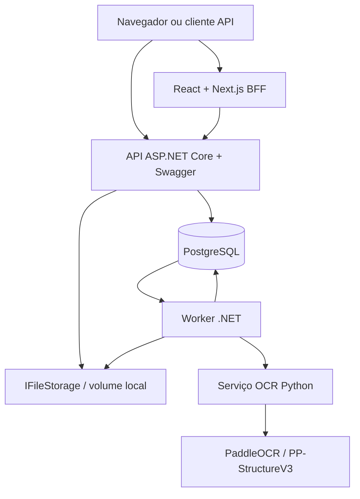
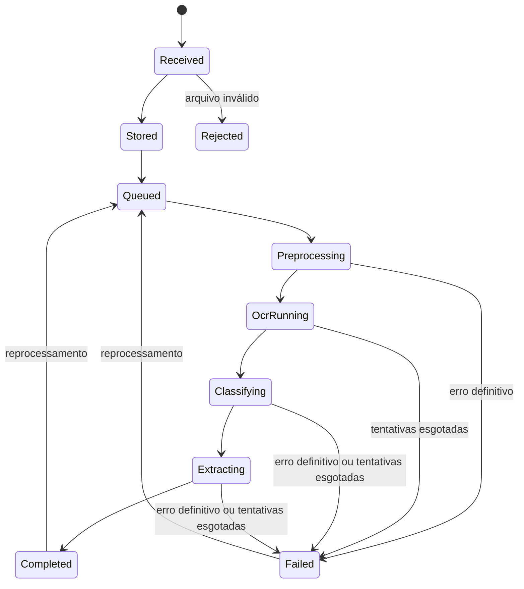

# PRD + SDD — PoC Local de Leitura de Documentos

**Status:** Pronto para refinamento e construção  
**Versão:** 2.0 — PoC local e agnóstica  
**Data:** 24/09/2026  
**Nome provisório:** DocReader PoC

---

## 1. Resumo executivo

Construir uma prova de conceito web, executada integralmente em contêineres Docker, capaz de:

- receber documentos por interface web ou API REST;
- armazenar o arquivo original e seus metadados;
- executar OCR local com tecnologia open source;
- identificar o tipo do documento;
- extrair texto e campos estruturados;
- listar todos os uploads realizados;
- consultar, visualizar e baixar qualquer documento enviado, sem login;
- exibir o resultado da leitura em uma tela de detalhes;
- disponibilizar documentação interativa da API por Swagger/OpenAPI.

A PoC não dependerá de AWS, Azure, Google Cloud ou APIs proprietárias. Todo o processamento deverá funcionar localmente por `docker compose up`.

### Stack recomendada

| Camada | Tecnologia da PoC |
|---|---|
| Frontend + BFF | React + TypeScript + Next.js |
| Backend/API | C# + ASP.NET Core na versão LTS vigente |
| Worker | .NET Worker Service |
| OCR local | PaddleOCR com PP-StructureV3, em serviço Python |
| OCR alternativo | Tesseract/OCRmyPDF, opcional |
| Parsing complementar | Docling, opcional para documentos digitais |
| Banco | PostgreSQL |
| Armazenamento | Volume Docker/local filesystem por `IFileStorage` |
| Fila da PoC | Tabela `processing_jobs` no PostgreSQL |
| Contrato da API | OpenAPI 3.x + Swagger UI |
| Orquestração | Docker Compose |

### Decisão de arquitetura

A aplicação será agnóstica em três pontos:

1. **OCR:** contrato `IDocumentOcrProvider`.
2. **Armazenamento:** contrato `IFileStorage`.
3. **Processamento assíncrono:** contrato `IProcessingQueue`.

Na PoC, esses contratos usarão PaddleOCR, volume local e PostgreSQL. Futuramente poderão ser substituídos por outro OCR, S3/MinIO/Azure Blob e SQS/RabbitMQ sem alterar o domínio nem a API pública.

---

## 2. Problema

Documentos de Pessoa Física e Pessoa Jurídica chegam em diferentes formatos, layouts e níveis de qualidade. A leitura manual é demorada, não escala e dificulta a reutilização dos dados.

A PoC deverá demonstrar que é possível:

- converter PDFs e imagens em texto pesquisável;
- reconhecer o tipo documental;
- localizar informações relevantes;
- persistir os resultados de forma estruturada;
- consultar os documentos e seus dados por interface e API;
- executar tudo localmente, sem contratação inicial de serviços externos.

---

## 3. Objetivos e indicadores

### Objetivo principal

Validar técnica e funcionalmente um pipeline local de ingestão, OCR, classificação, extração, armazenamento e consulta de documentos.

### Objetivos específicos

- Subir toda a solução com um único comando Docker Compose.
- Receber arquivos pelo navegador e pela API.
- Documentar e testar a API pelo Swagger.
- Processar documentos sem enviar dados a serviços externos.
- Exibir texto, campos, tipo identificado e confiança.
- Manter histórico dos uploads e processamentos.
- Permitir evolução futura para outros provedores sem reescrever o produto.

### Indicadores da PoC

- 100% dos uploads válidos recebem protocolo e aparecem na listagem.
- 100% dos endpoints públicos aparecem no Swagger.
- 100% dos arquivos são processados localmente.
- Pelo menos 90% dos documentos legíveis do conjunto de teste geram texto utilizável.
- Pelo menos 85% dos documentos priorizados são classificados corretamente.
- Campos críticos dos tipos homologados atingem ao menos 90% de exact match no dataset da PoC.
- Nenhum erro de OCR impede a consulta ao arquivo original.

---

## 4. Premissas, restrições e segurança do acesso anônimo

### Premissas

- A PoC será executada em computador ou servidor controlado.
- A infraestrutura terá Docker Engine e Docker Compose.
- O modo padrão funcionará apenas com CPU.
- GPU NVIDIA poderá ser habilitada por profile opcional.
- Serão usados documentos sintéticos, mascarados ou autorizados.
- Não haverá autenticação nem cadastro de usuários.
- Qualquer pessoa com acesso à aplicação poderá enviar, listar, visualizar e baixar documentos.

### Restrição importante

Como não haverá login, a PoC não deverá ser publicada diretamente na internet nem receber documentos pessoais reais em ambiente compartilhado.

O acesso anônimo será controlado por configuração:

```text
ALLOW_ANONYMOUS_ACCESS=true
```

Em uma futura versão produtiva, essa configuração deverá ser desabilitada e substituída por autenticação e autorização.

---

## 5. Fora do escopo

- Autenticação, autorização e usuários.
- Multi-tenancy.
- Integrações com Receita Federal, Serpro, cartórios, Senatran, conselhos ou tribunais.
- Validação oficial de autenticidade.
- Reconhecimento facial, prova de vida, KYC ou AML.
- Assinatura digital e validação ICP-Brasil.
- SLA produtivo, alta disponibilidade e disaster recovery.
- Aplicativo mobile nativo.
- Suporte estruturado a todos os documentos já no primeiro ciclo.

---

## 6. Jornadas

### Usuário da interface

- envia documentos;
- acompanha o processamento;
- consulta a lista;
- abre o detalhe;
- visualiza ou baixa o original;
- consulta texto e dados extraídos.

### Sistema integrador

- envia arquivo pela API;
- recebe o protocolo;
- consulta o status;
- obtém o resultado em JSON;
- lista documentos enviados.

### Desenvolvedor/testador

- utiliza o Swagger;
- testa uploads e consultas;
- acompanha logs e health checks;
- compara resultados de OCR.

---

## 7. Escopo documental

### Níveis de suporte

- **GENERIC_OCR:** aceita upload e extrai texto bruto.
- **CLASSIFIED:** também identifica o tipo documental.
- **STRUCTURED:** também extrai campos definidos em schema.
- **VALIDATED:** também executa regras determinísticas.
- **POC_APPROVED:** atingiu os critérios de qualidade da PoC.

Um arquivo processado pelo OCR não será automaticamente considerado estruturado ou homologado.

### Tipos estruturados prioritários

1. **cartão/comprovante de inscrição no CPF** (`BR_CPF_CARD`);
2. CIN/RG;
3. CNH;
4. comprovante de residência;
5. comprovante/cartão de CNPJ;
6. CCMEI;
7. contrato social.

O `BR_CPF_CARD` é o primeiro tipo a percorrer o caminho completo, da ingestão à extração validada, e
serve de referência para os demais. Campos: número de inscrição, nome e data de nascimento, com
validação de dígito verificador do CPF conforme RF-012. Schema em
`schemas/documents/BR_CPF_CARD.v1.json`.

Todos os demais tipos deverão ser aceitos como `GENERIC_OCR`.

### Catálogo-alvo — Pessoa Física

- CPF, CIN, RG, CNH, passaporte, título de eleitor e reservista;
- certidões de nascimento e casamento;
- CTPS Digital, PIS/PASEP/NIT, INSS e comprovantes de vínculo/contribuição;
- comprovantes de residência e renda;
- declaração de IR;
- escrituras, matrículas, CRLV-e e contratos;
- certidões negativas;
- registros profissionais, diplomas e certificados;
- informações visíveis de e-CPF, sem processar chave privada.

### Catálogo-alvo — Pessoa Jurídica

- CNPJ, contrato social, estatuto, requerimento de empresário e CCMEI;
- atas, alterações, consolidações e registros societários;
- inscrições estadual e municipal, cadastro previdenciário e regime tributário;
- alvarás, licenças, AVCB/CLCB e autorizações regulatórias;
- notas fiscais, livros, balanço, DRE, declarações e guias;
- folha, eSocial, FGTS, INSS e contratos de trabalho;
- certidões FGTS, federal, estadual, municipal, CNDT e falência;
- documentos de sócios, procurações e comprovante de sede;
- contratos bancários, de clientes, fornecedores e parceiros;
- políticas internas, LGPD e registros societários;
- informações visíveis de e-CNPJ, sem processar chave privada.

---

## 8. Requisitos funcionais

### RF-001 — Acesso anônimo

- A aplicação não solicitará login.
- Qualquer visitante com acesso à URL poderá enviar, listar e abrir documentos.
- O backend não exigirá bearer token.
- O Swagger será público no ambiente da PoC.
- A interface exibirá aviso de ambiente sem controle de acesso.

### RF-002 — Upload pela interface

- Drag-and-drop e seleção de arquivos.
- Um ou múltiplos arquivos.
- Formatos: PDF, PNG, JPG/JPEG e TIFF.
- Tamanho máximo padrão de 25 MB, configurável.
- Limite padrão de 50 páginas, configurável.
- Tipo esperado opcional.
- Classificação automática quando o tipo não for informado.
- Progresso e protocolo após envio.

### RF-003 — Upload pela API

- Endpoint `multipart/form-data`.
- Arquivo e metadados opcionais na mesma requisição.
- Retorno `202 Accepted` com id, protocolo, status e links.
- Header `Idempotency-Key` opcional.
- Campo `externalReference` opcional.
- Campo `expectedDocumentType` opcional.
- Payloads, limites, respostas e exemplos documentados no Swagger.

### RF-004 — Persistência inicial

Persistir antes do OCR:

- id UUID e protocolo legível;
- nome original e data/hora UTC;
- canal `WEB` ou `API`;
- referência externa;
- tamanho, MIME, SHA-256 e páginas;
- chave lógica do arquivo;
- tipo esperado;
- status.

### RF-005 — Listagem sem login

- Listar todos os uploads, mais recentes primeiro.
- Paginar resultados.
- Filtrar por protocolo, nome, tipo, canal, status e data.
- Permitir atualização manual e automática.
- Exibir estado vazio.

### RF-006 — Consulta e visualização sem login

- Abrir detalhe por id ou protocolo.
- Visualizar PDF ou imagem no navegador.
- Baixar o original.
- Exibir metadados, status e linha do tempo.
- Exibir tipo identificado e confiança.
- Exibir campos estruturados e confiança por campo.
- Exibir texto bruto por página.
- Exibir erros de processamento.
- Manter o original acessível mesmo se o OCR falhar.

### RF-007 — Processamento assíncrono

- O upload não aguardará o OCR.
- A API registrará um job persistente no PostgreSQL.
- O worker buscará jobs com bloqueio concorrente.
- Reinício do worker não perderá jobs.
- Jobs presos serão recuperados após timeout.
- Falhas transitórias terão até três tentativas com backoff.

Estados:

```text
RECEIVED → STORED → QUEUED → PREPROCESSING → OCR_RUNNING
→ CLASSIFYING → EXTRACTING → COMPLETED | FAILED | REJECTED
```

### RF-008 — OCR local

- Nenhum arquivo será enviado a serviço externo.
- O worker chamará um serviço OCR pela rede interna Docker.
- PaddleOCR/PP-StructureV3 será a implementação padrão.
- Português será habilitado no modelo aplicável.
- O resultado incluirá texto, página, bloco e coordenadas quando disponíveis.
- O resultado bruto do OCR será preservado.
- Provedor e versão do modelo serão registrados.

### RF-009 — Pré-processamento

- Detectar PDFs com camada textual.
- Extrair texto nativo antes de aplicar OCR, quando possível.
- Converter páginas em imagens quando necessário.
- Corrigir orientação e permitir deskew, contraste e redução de ruído.
- Preservar o original sem alterações.

### RF-010 — Classificação

- Classificar por palavras-chave e padrões na primeira versão.
- Retornar tipo, confiança e sinais utilizados.
- Retornar `UNKNOWN` sem evidência suficiente.
- Tratar o tipo esperado apenas como dica.
- Registrar divergência entre tipo esperado e identificado.

### RF-011 — Extração estruturada

- Extratores versionados por tipo documental.
- Combinar texto, posições, regex e regras determinísticas.
- Não depender de LLM externo.
- Retornar `null` para campo não encontrado.
- Nunca inventar informação ausente.
- Registrar valor bruto, normalizado, confiança e evidência.

### RF-012 — Normalização e validação

- Normalizar CPF/CNPJ, datas, CEP e UF.
- Validar dígitos verificadores de CPF e de CNPJ, inclusive de CNPJ alfanumérico.
- Preservar valor bruto.
- Marcar campos como `VALID`, `INVALID`, `NOT_FOUND` ou `UNCERTAIN`.

#### CNPJ alfanumérico

O CNPJ passa a admitir letras. O validador da PoC tratará o formato alfanumérico como regra geral e o numérico como caso particular, sem algoritmo duplicado.

- 14 posições: as 12 primeiras são alfanuméricas (`0`–`9` e `A`–`Z`), as 2 últimas são os dígitos verificadores e permanecem sempre numéricas.
- Máscara de exibição: `XX.XXX.XXX/XXXX-DV`.
- Normalização antes do cálculo: remover máscara, converter para maiúsculas e remover acentuação. Rejeitar caractere fora de `[0-9A-Z]` nas 12 primeiras posições e fora de `[0-9]` nos dois dígitos verificadores.
- O valor gravado em `normalized_value` terá 14 caracteres, sem máscara.
- CNPJ puramente numérico continua válido e produz o mesmo dígito verificador pelo novo cálculo.
- Valores com as 12 primeiras posições todas iguais serão rejeitados, mesmo quando o módulo 11 fechar.

Cálculo dos dígitos verificadores, por módulo 11 sobre valores derivados do ASCII:

1. Para cada uma das 12 primeiras posições, usar o valor `código ASCII do caractere − 48`. Assim `0`–`9` valem 0 a 9 e `A`–`Z` valem 17 a 42.
2. Primeiro dígito: multiplicar os 12 valores pelos pesos `5 4 3 2 9 8 7 6 5 4 3 2`, somar e calcular `soma mod 11`. Resto 0 ou 1 resulta em dígito 0; caso contrário o dígito é `11 − resto`.
3. Segundo dígito: repetir sobre os 13 valores, isto é as 12 posições mais o primeiro dígito, com os pesos `6 5 4 3 2 9 8 7 6 5 4 3 2` e a mesma regra de resto.

Casos de teste obrigatórios:

| Valor recebido | Normalizado | Resultado esperado |
|---|---|---|
| `12.ABC.345/01DE-35` | `12ABC34501DE35` | `VALID` |
| `12.abc.345/01de-35` | `12ABC34501DE35` | `VALID`, normalização de caixa |
| `04.252.011/0001-10` | `04252011000110` | `VALID`, numérico legado |
| `12.ABC.345/01DE-36` | `12ABC34501DE36` | `INVALID`, dígito verificador incorreto |
| `12.ABC.345/01DE-3X` | — | `INVALID`, dígito verificador não numérico |
| `AA.AAA.AAA/AAAA-45` | `AAAAAAAAAAAA45` | `INVALID`, 12 primeiras posições repetidas, ainda que o módulo 11 feche |

### RF-013 — Reprocessamento

- Reprocessar pela tela ou API.
- Criar nova tentativa sem apagar resultado anterior.
- Registrar versões do OCR, classificador e extrator.
- Impedir processamentos concorrentes do mesmo documento.

### RF-014 — Exclusão para limpeza

- Excluir pela tela e API.
- Exigir confirmação na interface.
- Remover arquivo, derivados, resultados e jobs.
- Informar que a ação é irreversível.

### RF-015 — Swagger/OpenAPI

- OpenAPI 3.x gerado pelo backend.
- Swagger UI em `/swagger`.
- JSON em `/swagger/v1/swagger.json`.
- Todos os códigos, schemas e exemplos documentados.
- Upload testável pela interface Swagger.
- Nota explícita sobre ausência de autenticação.

### RF-016 — Health checks

- `GET /health/live` para processo ativo.
- `GET /health/ready` para dependências essenciais.
- Readiness de PostgreSQL, storage e OCR.

---

## 9. Telas

### Página inicial

- aviso “PoC local sem autenticação”;
- drag-and-drop;
- tipo opcional;
- formatos e limites;
- progresso;
- protocolo e link do documento;
- links para lista e Swagger.

### Lista

| Coluna | Conteúdo |
|---|---|
| Protocolo | identificador legível |
| Arquivo | nome original |
| Tipo | identificado ou `UNKNOWN` |
| Canal | WEB ou API |
| Enviado em | data/hora |
| Status | etapa atual |
| Confiança | quando disponível |
| Ações | visualizar, baixar, reprocessar e excluir |

### Detalhe

- visualizador à esquerda e resultado à direita;
- abas `Campos`, `Texto bruto`, `Metadados`, `Processamento` e `Resultado técnico`;
- confiança visual;
- download, reprocessamento e exclusão.

---

## 10. Arquitetura



### Web + BFF

- Next.js, React e TypeScript no mesmo projeto.
- O BFF atua como fachada do navegador.
- Não contém regras de OCR ou persistência.
- A API .NET também pode ser chamada diretamente.

### API .NET

- Valida upload, gera protocolo, armazena arquivo e cria job.
- Lista, consulta, entrega, reprocessa e exclui documentos.
- Publica OpenAPI e Swagger.

### Worker .NET

- Reserva jobs, prepara documentos, chama OCR, classifica, extrai, valida e persiste.
- Controla timeout, retries e falhas.

### Serviço OCR Python

- FastAPI interno.
- PaddleOCR/PP-StructureV3 como padrão.
- Imagem CPU obrigatória e profile GPU opcional.
- Não exposto fora da rede Docker.

### PostgreSQL como banco e fila

Para a PoC, a tabela de jobs elimina RabbitMQ/Kafka. O worker usará bloqueio equivalente a:

```sql
SELECT id FROM processing_jobs
WHERE status = 'PENDING' AND available_at <= now()
ORDER BY created_at
FOR UPDATE SKIP LOCKED
LIMIT 1;
```

### Armazenamento local

- Volume Docker persistente.
- Chaves internas por UUID, nunca pelo nome fornecido.
- `IFileStorage` para escrita, leitura e exclusão.
- Banco guarda metadados e caminhos lógicos, não o binário.

---

## 11. Contratos de abstração

```csharp
public interface IDocumentOcrProvider
{
    string ProviderName { get; }
    Task<OcrResult> AnalyzeAsync(DocumentContent document, OcrOptions options, CancellationToken ct);
}

public interface IFileStorage
{
    Task<StoredFile> SaveAsync(Stream content, FileMetadata metadata, CancellationToken ct);
    Task<Stream> OpenReadAsync(string storageKey, CancellationToken ct);
    Task DeleteAsync(string storageKey, CancellationToken ct);
}

public interface IProcessingQueue
{
    Task EnqueueAsync(Guid documentId, CancellationToken ct);
    Task<ProcessingJob?> AcquireNextAsync(CancellationToken ct);
    Task CompleteAsync(Guid jobId, CancellationToken ct);
    Task FailAsync(Guid jobId, ProcessingError error, CancellationToken ct);
}

public interface IDocumentExtractor
{
    string DocumentType { get; }
    int SchemaVersion { get; }
    Task<StructuredExtraction> ExtractAsync(OcrResult result, CancellationToken ct);
}
```

---

## 12. Fluxo



1. Cliente envia arquivo pela UI ou API.
2. API valida arquivo, calcula SHA-256 e grava no storage.
3. API persiste documento e job e retorna `202 Accepted`.
4. Worker reserva o job e prepara as páginas.
5. Worker chama o OCR local.
6. Worker classifica, extrai, normaliza e valida.
7. Worker grava o resultado e conclui o job.
8. Interface acompanha o status por polling.

---

## 13. Estratégia open source

### Motor principal

**PaddleOCR com PP-StructureV3** será o padrão por combinar OCR, layout e tratamento de estruturas como tabelas, produzindo saídas estruturadas.

Ele ficará isolado em serviço Python para:

- manter o backend em C#;
- separar dependências de visão computacional;
- permitir troca de engine;
- suportar imagens CPU/GPU distintas;
- isolar falhas e consumo de memória.

### Complementos

| Ferramenta | Papel | Decisão |
|---|---|---|
| Docling | parsing de PDF/DOCX e estruturas digitais | spike opcional |
| Tesseract | OCR simples em português | adapter alternativo e baseline |
| OCRmyPDF | gerar camada pesquisável em PDF escaneado | opcional |
| OpenCV | rotação, deskew, contraste e ruído | usar se melhorar o benchmark |

### Benchmark mínimo

- 20 a 50 amostras por tipo priorizado.
- Documentos digitais, escaneados e fotografados.
- Frente/verso e variações de qualidade.
- Ground truth manual dos campos críticos.
- Medir CER/WER, classificação, exact match, latência, memória e falha por formato.

---

## 14. Modelo de dados

### `documents`

- `id`, `protocol`, `original_file_name`, `storage_key`;
- `mime_type`, `size_bytes`, `sha256`, `page_count`;
- `upload_channel`, `external_reference`;
- `expected_document_type`, `detected_document_type`;
- `classification_confidence`, `status`;
- `uploaded_at`, `completed_at`;
- `last_error_code`, `last_error_message`.

### `processing_jobs`

- `id`, `document_id`, `status`, `stage`;
- `attempt_count`, `available_at`;
- `locked_at`, `locked_by`;
- `started_at`, `finished_at`;
- `error_code`, `error_message`, `created_at`.

### `extractions`

- `id`, `document_id`, `processing_job_id`;
- `ocr_provider`, `ocr_model_version`;
- `classifier_version`, `extractor_version`, `schema_version`;
- `raw_text`, `raw_ocr_result`, `structured_result`;
- `overall_confidence`, `created_at`.

### `extracted_fields`

- `id`, `extraction_id`, `field_path`;
- `raw_value`, `normalized_value`, `confidence`;
- `page_number`, `bounding_box`;
- `validation_status`, `validation_messages`.

### `document_events`

- `id`, `document_id`, `event_type`, `stage`, `details`, `occurred_at`.

### `idempotency_keys`

- `key`, `file_sha256`, `document_id`;
- `response_status`, `response_body`;
- `created_at`, `expires_at`.

---

## 15. Resultado canônico

```json
{
  "id": "95c82e23-bbf4-46ba-9a92-f34417fe213e",
  "protocol": "DOC-20260924-000001",
  "status": "COMPLETED",
  "upload": {
    "fileName": "documento.pdf",
    "channel": "API",
    "uploadedAt": "2026-09-24T22:00:00Z",
    "externalReference": "CLIENTE-123"
  },
  "classification": {
    "detectedType": "BR_CNPJ_CARD",
    "confidence": 0.96,
    "classifierVersion": "rules-1.0.0"
  },
  "extraction": {
    "ocrProvider": "paddleocr",
    "schemaVersion": 1,
    "fields": {
      "companyName": {
        "raw": "EMPRESA EXEMPLO LTDA",
        "normalized": "Empresa Exemplo Ltda",
        "confidence": 0.98,
        "validationStatus": "VALID",
        "evidence": { "page": 1, "boundingBox": [] }
      },
      "cnpj": {
        "raw": "12.ABC.345/01DE-35",
        "normalized": "12ABC34501DE35",
        "confidence": 0.99,
        "validationStatus": "VALID",
        "evidence": { "page": 1, "boundingBox": [] }
      }
    }
  }
}
```

## 16. API REST

### Upload

`POST /api/v1/documents`

Content-Type: `multipart/form-data`

- `file` — obrigatório;
- `expectedDocumentType` — opcional;
- `externalReference` — opcional;
- header `Idempotency-Key` — opcional.

Resposta:

```http
HTTP/1.1 202 Accepted
Location: /api/v1/documents/{id}
```

```json
{
  "id": "95c82e23-bbf4-46ba-9a92-f34417fe213e",
  "protocol": "DOC-20260924-000001",
  "status": "QUEUED",
  "statusUrl": "/api/v1/documents/95c82e23-bbf4-46ba-9a92-f34417fe213e/status",
  "documentUrl": "/api/v1/documents/95c82e23-bbf4-46ba-9a92-f34417fe213e"
}
```

#### Idempotency-Key

- Header opcional em `POST /api/v1/documents`.
- Escopo da idempotência: o par `Idempotency-Key` mais o SHA-256 do arquivo recebido.
- Chave inédita: o documento é criado normalmente e o par chave/hash é registrado junto da resposta emitida.
- Mesma chave com o mesmo SHA-256, dentro do TTL: a resposta original é repetida, com `202`, o mesmo `id`, o mesmo `protocol` e o mesmo `Location`, sem criar documento nem job adicional. A repetição é sinalizada pelo header `Idempotency-Replayed: true`.
- Mesma chave com SHA-256 diferente: `409 Conflict` em `application/problem+json`, sem criar documento.
- TTL configurável por `IDEMPOTENCY_KEY_TTL`, com padrão de 24 horas. Registro expirado é descartado e a chave volta a ser reutilizável.
- As chaves são persistidas em `idempotency_keys`, de forma que reinício de contêiner não reabra janela de duplicidade.
- Sem o header não há verificação: dois envios idênticos geram dois documentos.

### Demais endpoints

| Método | Endpoint | Finalidade |
|---|---|---|
| GET | `/api/v1/documents` | listar com filtros e paginação |
| GET | `/api/v1/documents/{id}` | detalhe consolidado |
| GET | `/api/v1/documents/by-protocol/{protocol}` | consulta por protocolo |
| GET | `/api/v1/documents/{id}/status` | status leve para polling |
| GET | `/api/v1/documents/{id}/content` | visualizar ou baixar original |
| GET | `/api/v1/documents/{id}/text` | texto bruto |
| GET | `/api/v1/documents/{id}/result` | resultado estruturado |
| POST | `/api/v1/documents/{id}/reprocess` | reprocessar |
| DELETE | `/api/v1/documents/{id}` | excluir definitivamente |
| GET | `/api/v1/document-types` | tipos e níveis suportados |
| GET | `/health/live` | liveness |
| GET | `/health/ready` | readiness |

O endpoint de conteúdo responderá com `Content-Disposition: inline` quando suportado e aceitará `?download=true`.

### Padrões

- JSON camelCase.
- Datas UTC/ISO 8601.
- `application/problem+json` para erros.
- `X-Correlation-Id` em todas as respostas.
- `404` para documento inexistente.
- `409` para operação conflitante.
- `413` para arquivo acima do limite.
- `415` para formato não suportado.
- `422` para conteúdo inválido para processamento.

---

## 17. Swagger — Definition of Done

O Swagger será considerado entregue quando:

- abrir em `http://localhost:<porta>/swagger`;
- listar todos os endpoints públicos;
- permitir selecionar e enviar arquivo;
- mostrar schemas de request e response;
- mostrar exemplos de sucesso e erro;
- descrever o retorno assíncrono `202`;
- permitir consultar o status usando o id retornado;
- documentar filtros e paginação;
- identificar endpoints destrutivos;
- disponibilizar o OpenAPI JSON;
- funcionar após subir somente o Docker Compose, sem SDK local.

---

## 18. Docker Compose

### Serviços obrigatórios

```text
web-bff       React + Next.js
api           ASP.NET Core + Swagger
worker        .NET Worker Service
ocr-service   Python + FastAPI + PaddleOCR
postgres      PostgreSQL
```

### Volumes

```text
postgres-data     dados do banco
document-storage arquivos originais e derivados
ocr-model-cache   modelos do OCR
```

### Redes

- `public`: web e API.
- `internal`: API, worker, OCR e PostgreSQL.
- PostgreSQL e OCR não publicarão portas por padrão, exceto em profile de desenvolvimento.

### Inicialização

```bash
docker compose up --build
```

Comportamento esperado:

- migrations controladas;
- health checks;
- dependências condicionadas à saúde quando aplicável;
- dados preservados entre reinícios;
- modelos OCR disponíveis sem configuração manual após primeiro download/build;
- `.env.example` sem segredos;
- portas configuráveis;
- imagens executadas como usuário não root quando possível.

### GPU opcional

```bash
docker compose --profile gpu up --build
```

O profile CPU continuará obrigatório para aceite.

---

## 19. Estrutura sugerida do repositório

```text
/apps
  /web-bff
  /api
  /worker
/services
  /ocr-service
/src
  /DocReader.Domain
  /DocReader.Application
  /DocReader.Infrastructure
  /DocReader.Api.Contracts
/tests
  /unit
  /integration
  /e2e
  /accuracy
/schemas
  /documents
/samples
  /synthetic
/deploy
  /docker
/docs
  /adr
  /api
docker-compose.yml
.env.example
README.md
```

---

## 20. Requisitos não funcionais

### Portabilidade

- Sem dependência obrigatória de cloud.
- Sem caminhos fixos específicos de sistema operacional.
- Configuração por variáveis de ambiente.
- Interfaces para OCR, storage e fila.

### Performance inicial

- Protocolo em até 2 segundos após conclusão da transferência.
- Listagem p95 abaixo de 1 segundo com até 10 mil documentos.
- Documento de cinco páginas processado em até 90 segundos na máquina de referência a definir.
- OCR sempre fora da requisição HTTP.

### Resiliência

- Reiniciar contêineres sem perder documentos aceitos.
- Jobs persistentes.
- Processamento idempotente.
- Timeout e retry configuráveis.
- Resultado parcial nunca aparece como `COMPLETED`.

### Observabilidade

- Logs estruturados em stdout.
- Correlation id ponta a ponta.
- Contadores de uploads, status, duração, erros e páginas.
- Versão do OCR registrada.
- Nenhum arquivo ou texto integral nos logs.

### Usabilidade

- Interface responsiva para desktop e tablet.
- Status compreensíveis.
- Erros com orientação.
- Atualização do status sem reload completo.

---

## 21. Segurança mínima

Mesmo sem login, a PoC deverá:

- limitar tamanho, páginas e formatos;
- validar MIME real;
- gerar nomes internos seguros;
- impedir path traversal;
- bloquear executáveis disfarçados;
- usar SQL parametrizado;
- limitar CPU, memória e timeout do OCR;
- aplicar cabeçalhos básicos de segurança;
- não registrar conteúdo documental;
- não expor PostgreSQL ou OCR externamente;
- limitar CORS às origens configuradas;
- exibir aviso de acesso anônimo;
- usar somente dados sintéticos, mascarados ou autorizados.

Antivírus não é bloqueante no primeiro corte, desde que o ambiente seja isolado e os arquivos de teste controlados.

---

## 22. Classificação e extração

### Classificação inicial

Regras versionadas em YAML ou JSON:

```yaml
documentType: BR_CNH
version: 1
requiredSignals:
  - "CARTEIRA NACIONAL DE HABILITAÇÃO"
optionalSignals:
  - "Nº REGISTRO"
  - "VALIDADE"
negativeSignals:
  - "CADASTRO NACIONAL DA PESSOA JURÍDICA"
threshold: 0.75
```

### Extração

Cada tipo terá:

- JSON Schema;
- aliases de rótulos;
- expressões regulares;
- regras espaciais quando disponíveis;
- normalizadores;
- validadores;
- dados de teste.

Exemplo:

```json
{
  "$id": "BR_CNH.v1",
  "type": "object",
  "properties": {
    "name": { "type": ["string", "null"] },
    "cpf": { "type": ["string", "null"] },
    "registrationNumber": { "type": ["string", "null"] },
    "birthDate": { "type": ["string", "null"], "format": "date" },
    "expirationDate": { "type": ["string", "null"], "format": "date" },
    "category": { "type": ["string", "null"] }
  }
}
```

---

## 23. Testes

### Unitários

- CPF e CNPJ, cobrindo o CNPJ alfanumérico e os casos de teste do RF-012;
- datas e normalização;
- classificação;
- transições de status;
- retry.

### Integração

- API + PostgreSQL;
- API + storage local;
- worker + banco;
- worker + OCR;
- migrations;
- OpenAPI JSON válido.

### E2E

- upload web até resultado;
- upload pelo Swagger;
- upload por `curl`;
- listagem e filtros;
- reprocessamento e exclusão;
- reinício do worker;
- falha do OCR com preservação do original.

### Acurácia

- dataset versionado;
- ground truth por campo;
- relatório por tipo e qualidade;
- regressão a cada mudança de modelo, regra ou pré-processamento.

---

## 24. Critérios de aceite

1. `docker compose up --build` sobe a solução inteira.
2. A interface abre sem login.
3. A página inicial envia PDF, PNG, JPEG e TIFF.
4. `POST /api/v1/documents` recebe documentos por API.
5. O Swagger abre sem login e executa upload.
6. A API retorna `202`, id e protocolo.
7. O documento aparece imediatamente na lista.
8. Lista e detalhe são consultados sem login.
9. O original pode ser visualizado e baixado.
10. O worker não perde o job após reinício.
11. O OCR funciona sem chamada de cloud.
12. O texto bruto é exibido por página.
13. O tipo é identificado ou retorna `UNKNOWN`.
14. Tipos estruturados retornam campos, confiança e validação.
15. CPF e CNPJ passam por validação de dígito verificador, inclusive CNPJ alfanumérico com letras nas 12 primeiras posições.
16. Falha no OCR mantém o original consultável.
17. Reprocessamento cria nova tentativa.
18. Exclusão remove banco e arquivos relacionados.
19. PostgreSQL e OCR não ficam expostos por padrão.
20. Todos os endpoints aparecem no OpenAPI.

---

## 25. Backlog

### Épico 1 — Fundação Docker

- monorepo, Dockerfiles, Compose, PostgreSQL, migrations e health checks.

### Épico 2 — Upload e consulta

- storage, upload web/API, protocolo, lista, detalhe e download.

### Épico 3 — Processamento

- jobs, worker, retries, eventos e reprocessamento.

### Épico 4 — OCR local

- serviço Python, PaddleOCR, PDFs/imagens e pré-processamento.

### Épico 5 — Inteligência documental

- classificador, schemas, extratores, normalizadores e validadores.

### Épico 6 — Swagger e qualidade

- exemplos, testes, dataset, relatório e README.

---

## 26. Plano de execução

### Etapa 1 — Walking skeleton

- Compose completo;
- upload pela API;
- persistência;
- lista e download;
- Swagger.

### Etapa 2 — OCR ponta a ponta

- worker;
- PaddleOCR;
- texto bruto;
- status e detalhe.

### Etapa 3 — Extração estruturada

- classificação;
- CNH/CIN;
- CNPJ/CCMEI;
- comprovante de residência;
- contrato social.

### Etapa 4 — Avaliação

- dataset;
- métricas;
- comparação opcional com Tesseract/Docling;
- decisão sobre continuidade e produção.

---

## 27. Riscos

| Risco | Mitigação |
|---|---|
| Acesso anônimo expõe documentos | somente local/rede privada e dados sintéticos/autorizados |
| CPU tornar OCR lento | limitar páginas, benchmark e profile GPU |
| Imagem OCR ficar grande | serviço e cache separados |
| Layout brasileiro não reconhecido | adapters e benchmark com alternativas |
| OCR confundido com extração | níveis explícitos de suporte |
| Job perdido | fila persistida no PostgreSQL |
| Banco virar gargalo | aceitável na PoC; manter `IProcessingQueue` |
| Volume local crescer | limites e exclusão/limpeza |
| Campo ausente ser inventado | `null` obrigatório sem evidência |
| API divergir da documentação | OpenAPI gerado pelo código e testado |

---

## 28. Entregáveis

- código-fonte;
- `docker-compose.yml` e Dockerfiles;
- `.env.example`;
- migrations;
- frontend React/Next.js e BFF;
- API ASP.NET Core;
- worker .NET;
- serviço OCR Python/PaddleOCR;
- schemas e regras iniciais;
- Swagger UI e OpenAPI JSON;
- testes automatizados;
- amostras sintéticas;
- README com execução e exemplos `curl`;
- relatório de acurácia e performance.

---

## 29. Decisões não bloqueantes

- versão exata dos modelos PaddleOCR;
- inclusão de Docling no primeiro ciclo;
- porta externa;
- limites finais;
- polling ou Server-Sent Events;
- GPU na demonstração;
- tipos adicionais.

As decisões serão registradas em ADRs curtos.

---

## 30. Recomendação final

Construir a PoC com cinco contêineres obrigatórios: `web-bff`, `api`, `worker`, `ocr-service` e `postgres`.

Usar:

- Next.js/React para interface e BFF;
- ASP.NET Core para API e Swagger;
- .NET Worker para processamento;
- PaddleOCR/PP-StructureV3 em FastAPI para OCR local;
- PostgreSQL para dados e jobs;
- volume Docker por trás de `IFileStorage` para arquivos.

Essa composição executa tudo localmente, mantém a solução agnóstica e reduz a infraestrutura necessária. O primeiro marco será o fluxo upload → protocolo → listagem → OCR → detalhe → resultado pela interface e pelo Swagger.

---

## 31. Referências oficiais

- [PaddleOCR](https://www.paddleocr.ai/)
- [PP-StructureV3](https://paddlepaddle.github.io/PaddleOCR/main/en/version3.x/pipeline_usage/PP-StructureV3.html)
- [Docling](https://docling-project.github.io/docling/)
- [Tesseract OCR](https://tesseract-ocr.github.io/tessdoc/)
- [OCRmyPDF](https://ocrmypdf.readthedocs.io/)
- [ASP.NET Core OpenAPI](https://learn.microsoft.com/aspnet/core/fundamentals/openapi/overview)

---
