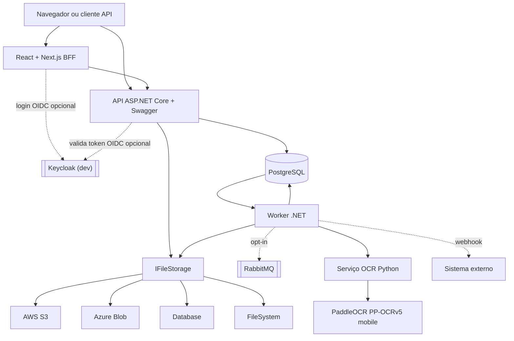
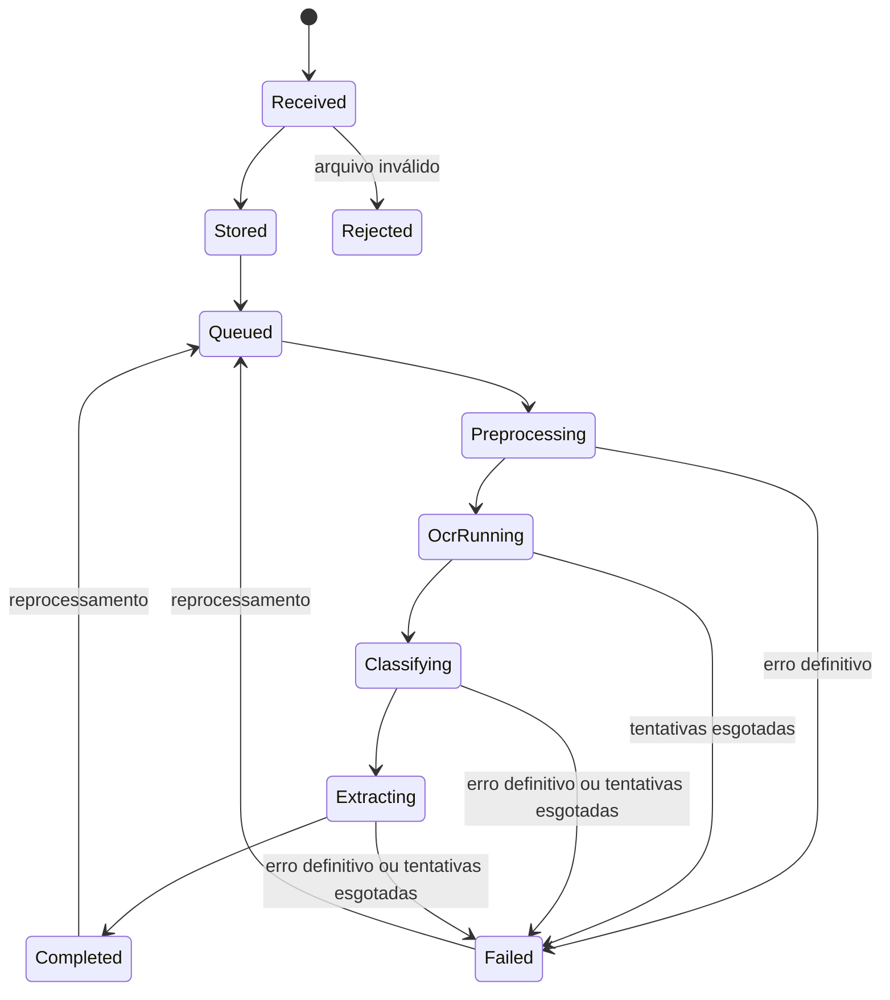

# PRD + SDD — PoC Local de Leitura de Documentos

**Status:** Em produção de PoC — sete épicos entregues além do desenho original  
**Versão:** 3.0 — descreve o sistema como ele é hoje, depois de sete épicos que a v2.0 não cobria  
**Data:** 29/09/2026  
**Nome provisório:** DocReader PoC

**O que mudou desde a v2.0** (24/09/2026, escrita antes da Etapa 1): a v2.0 descrevia a PoC planejada; esta
versão descreve a PoC construída. Entram requisitos funcionais para produto/serviço vinculado, retenção com
expurgo automático, repositórios de armazenamento configuráveis (FileSystem/Database/Azure/S3) com
backup/restore/migração, webhooks, consulta por referência externa, tipos documentais administráveis em
runtime, autenticação OIDC com RBAC, auditoria, cifra em repouso, exclusão sob LGPD com aprovação, os
endpoints de diagnóstico de classificação e extração, e o pré-processamento de OCR completo (camada de texto
nativa de PDF, correção de rotação/inclinação, PP-StructureV3 sob demanda) — o RF-009 sai de "fora do
escopo" para implementado. As seções de indicadores (§3), fora do escopo (§5) e critérios de aceite (§24)
foram revistas para refletir o que foi medido e o que continua pendente. Nenhuma seção descreve requisito
não implementado como concluído; onde a entrega é parcial, o texto diz que é parcial.

---

## 1. Resumo executivo

Construir, e hoje operar, uma prova de conceito web, executada integralmente em contêineres Docker, capaz de:

- receber documentos por interface web ou API REST, opcionalmente vinculados a um produto/serviço;
- armazenar o arquivo original e seus metadados, num de quatro provedores de armazenamento configuráveis;
- executar OCR local com tecnologia open source, com pré-processamento (camada de texto nativa de PDF,
  correção de rotação/inclinação);
- identificar o tipo do documento, com regras administráveis em runtime, sem deploy;
- extrair texto e campos estruturados, com diagnóstico de por que um campo ou uma classificação saiu como saiu;
- listar todos os uploads realizados, com retenção configurável e expurgo automático dos vencidos;
- consultar, visualizar e baixar qualquer documento enviado, com autenticação OIDC opcional (anônimo por
  padrão, como na v2.0);
- exibir o resultado da leitura em uma tela de detalhes;
- notificar sistemas externos por webhook quando um documento termina;
- disponibilizar documentação interativa da API por Swagger/OpenAPI;
- atender pedido de exclusão do titular (LGPD/GDPR), com aprovação e trilha de auditoria.

A PoC não depende de AWS, Azure, Google Cloud ou APIs proprietárias para o caminho principal (o Azure Blob e
o AWS S3 do §"Repositórios de armazenamento" são destinos **opcionais** de armazenamento, nunca o único
caminho). Todo o processamento funciona localmente por `docker compose up`.

### Stack

| Camada | Tecnologia |
|---|---|
| Frontend + BFF | React + TypeScript + Next.js (App Router); login opcional via NextAuth.js quando OIDC está configurado |
| Backend/API | C# + ASP.NET Core (net10.0) |
| Worker | .NET Worker Service |
| OCR local | PaddleOCR **PP-OCRv5 mobile** em CPU, em serviço Python (padrão medido; ver ADR 0002) |
| Pré-processamento de OCR | pdfplumber (camada de texto nativa de PDF), OpenCV (rotação/deskew), PP-StructureV3 sob demanda (medido, desligado por padrão) |
| Banco | PostgreSQL |
| Armazenamento | `IFileStorage` sobre um de quatro adaptadores: FileSystem, Database, Azure Blob Storage, AWS S3 |
| Fila | Tabela `processing_jobs` no PostgreSQL (padrão, ADR 0001) ou RabbitMQ (opt-in, ADR 0004) |
| Autenticação | Nenhuma por padrão (`ALLOW_ANONYMOUS_ACCESS=true`); OIDC/JWT bearer opt-in na API (ADR 0003) com Keycloak de desenvolvimento |
| Contrato da API | OpenAPI 3.x + Swagger UI |
| Orquestração | Docker Compose |

Tesseract, OCRmyPDF e Docling — cogitados na v2.0 como alternativas/complementos — não foram adotados; ver
§13.

### Decisão de arquitetura

A aplicação é agnóstica em três pontos:

1. **OCR:** contrato `IDocumentOcrProvider`. Implementação única (PaddleOCR via `ocr-service`), mas o
   contrato já suporta troca.
2. **Armazenamento:** contrato `IFileStorage`, hoje uma fachada que escolhe entre quatro `IStorageAdapter`
   por documento (herdado do produto/serviço ou do repositório padrão) — a troca de provedor que a v2.0
   previa como futura já existe.
3. **Processamento assíncrono:** contrato `IProcessingQueue`, com duas implementações reais (PostgreSQL e
   RabbitMQ) selecionadas por configuração, sem mudança em `Domain` nem `Application`.

Esses três pontos continuam sendo o que separa domínio e API pública da tecnologia por trás.

---

## 2. Problema

Documentos de Pessoa Física e Pessoa Jurídica chegam em diferentes formatos, layouts e níveis de qualidade. A leitura manual é demorada, não escala e dificulta a reutilização dos dados.

A PoC deverá demonstrar que é possível:

- converter PDFs e imagens em texto pesquisável;
- reconhecer o tipo documental;
- localizar informações relevantes;
- persistir os resultados de forma estruturada;
- consultar os documentos e seus dados por interface e API;
- executar tudo localmente, sem contratação inicial de serviços externos.

---

## 3. Objetivos e indicadores

### Objetivo principal

Validar técnica e funcionalmente um pipeline local de ingestão, OCR, classificação, extração, armazenamento e consulta de documentos.

### Objetivos específicos

- Subir toda a solução com um único comando Docker Compose.
- Receber arquivos pelo navegador e pela API.
- Documentar e testar a API pelo Swagger.
- Processar documentos sem enviar dados a serviços externos.
- Exibir texto, campos, tipo identificado e confiança.
- Manter histórico dos uploads e processamentos.
- Permitir evolução futura para outros provedores sem reescrever o produto.

### Indicadores da PoC

Três indicadores dependem de dataset (documentos reais anotados) para ter significado estatístico; os
outros quatro são estruturais e são conferidos por teste automatizado, não por amostragem. `docs/evaluation.md`
e `scripts/evaluate.py` são o framework que mede os três primeiros; `docs/bench/real-exploratory-v1.md` é a
única medição contra documento real feita até hoje.

**Estruturais — medidos, sem depender de dataset:**

- 100% dos uploads válidos recebem protocolo e aparecem na listagem — coberto por teste de integração e
  e2e.
- 100% dos endpoints públicos aparecem no Swagger — conferido pelo DoD do §17.
- 100% dos arquivos são processados localmente — nenhuma chamada de rede externa no caminho de OCR/extração;
  conferido por revisão de código e pela rede Docker `internal` não ter saída configurada.
- Nenhum erro de OCR impede a consulta ao arquivo original — coberto por teste de integração (`ocr-service`
  parado no meio de um documento) e por verificação manual (README, "Verificação manual de resiliência").

**Dependentes de dataset — só medidos contra amostra sintética até hoje:**

- **Pelo menos 90% dos documentos legíveis geram texto utilizável.** Sintético: 100% (as sete amostras,
  `samples/synthetic/documents`, teste de fumaça do avaliador). Real: **não medido com significância** — o
  teste exploratório (`docs/bench/real-exploratory-v1.md`) rodou só 4 documentos, um de cada finalidade, sem
  ground truth formal; todos os 4 geraram texto utilizável, mas 4 documentos não sustentam um percentual.
- **Pelo menos 85% dos documentos priorizados são classificados corretamente.** Sintético: 100% (mesmo teste
  de fumaça). Real: no teste exploratório, 3 dos 4 documentos classificaram certo com 100% de confiança; o
  quarto (uma CNH digital) saiu `UNKNOWN` por uma camada de texto nativa insuficiente, achado corrigido nesta
  mesma rodada (ver RF-009 e `docs/bench/real-exploratory-v1.md`). De novo, 4 documentos não sustentam um
  percentual — o indicador **não está medido** no sentido do PRD, só ilustrado.
- **Campos críticos atingem ao menos 90% de exact match.** Sintético: 100% nos sete tipos (teste de fumaça).
  Real: parcialmente calibrado (Etapa 5) para dois tipos — CNH (4/8 → 7/8 campos lidos, dois exemplares) e
  CIN/RIC (2/10 → 10/10, dois exemplares) — e os outros cinco tipos (`BR_CPF_CARD`, `BR_PROOF_OF_ADDRESS`,
  `BR_CNPJ_CARD`, `BR_CCMEI`, `BR_SOCIAL_CONTRACT`) nunca foram calibrados contra documento real. O teste
  exploratório encontrou e corrigiu três defeitos que só apareciam em documento real (ver
  `docs/bench/real-exploratory-v1.md`); quatro achados continuam abertos porque calibrar contra um ou dois
  exemplares não generaliza — a decisão registrada é esperar um conjunto real anotado maior antes de mexer
  nos extratores de novo.

**Não há decisão de continuidade e produção tomada**: ela dependeria dos três indicadores acima medidos
contra um dataset real de tamanho estatisticamente significativo, que não existe neste repositório (nem
poderia: documento real não entra no repositório, ver `docs/evaluation.md`).

---

## 4. Premissas, restrições e segurança do acesso anônimo

### Premissas

- A PoC roda em computador ou servidor controlado.
- A infraestrutura tem Docker Engine e Docker Compose.
- O modo padrão funciona apenas com CPU.
- GPU NVIDIA pode ser habilitada por profile opcional.
- São usados documentos sintéticos, mascarados ou autorizados.
- **Autenticação é opcional, não obrigatória.** Por padrão continua como a v2.0 previa: sem login, qualquer
  pessoa com acesso à aplicação pode enviar, listar, visualizar e baixar documentos. Quando `OIDC_AUTHORITY`
  é configurada (RF-023), a API passa a exigir um token JWT bearer válido em toda chamada, e os três
  endpoints de administração (`/admin/backup`, `/admin/restore`, `/admin/storage-migration`) passam a exigir
  também o papel de administrador. Os dois modos nunca coexistem: um dado ambiente está inteiramente num ou
  no outro.
- O login do BFF (quando OIDC está configurado) é feito por um Keycloak de desenvolvimento local
  (`docker-compose.dev.yml`), não por um IdP de produção — trocar para Azure AD ou outro IdP corporativo é
  reconfiguração de variável de ambiente, não código, mas não foi verificado contra um IdP real (ver ADR
  0003).

### Restrição importante

Sem autenticação (o padrão), a PoC não deve ser publicada diretamente na internet nem receber documentos
pessoais reais em ambiente compartilhado.

O acesso anônimo é controlado por configuração:

```text
ALLOW_ANONYMOUS_ACCESS=true
```

Com OIDC configurado, essa variável deixa de ter efeito: o desafio 401 do JWT bearer passa a ser o portão.
Ver RF-023 e ADR 0003.

---

## 5. Fora do escopo

### Saiu do fora de escopo desde a v2.0

- **Autenticação e autorização.** Saiu parcialmente: OIDC/JWT bearer na API e RBAC nos três endpoints de
  admin existem (RF-023), com login do BFF via NextAuth.js. O que continua fora: cadastro de usuários
  (usuários vêm de um IdP externo, nunca são gerenciados por esta PoC), RBAC granular nos demais
  controllers (`documents`, `document-types`, `product-services`, `retention-policies`,
  `storage-repositories`, `webhook-subscriptions` ainda não têm `[Authorize(Roles=...)]`, só a exigência
  geral de token quando OIDC está ligado) e integração verificada contra um IdP de produção — só Keycloak de
  desenvolvimento foi testado.

### Continua fora do escopo

- Multi-tenancy.
- Integrações com Receita Federal, Serpro, cartórios, Senatran, conselhos ou tribunais.
- Validação oficial de autenticidade.
- Reconhecimento facial, prova de vida, KYC ou AML.
- Assinatura digital e validação ICP-Brasil.
- SLA produtivo, alta disponibilidade e disaster recovery.
- Aplicativo mobile nativo.
- Suporte estruturado a todos os documentos já no primeiro ciclo (sete tipos têm extrator hoje; o restante
  do catálogo-alvo do §7 continua `GENERIC_OCR`).
- **RBAC granular** fora dos três endpoints de admin (ver acima).
- **Autenticação de máquina a máquina** fora do fluxo BFF → API: o `ClientId` do OIDC assume um client (o
  BFF); um segundo cliente de API-a-API é extensão futura (ver ADR 0003, "Gatilhos de revisão").
- **Comparação com Tesseract/Docling** (cogitada no §26 da v2.0): não foi feita; PaddleOCR PP-OCRv5 mobile
  segue como única engine avaliada (ADR 0002).
- **Autenticação dos endpoints de admin de backup/restore/migração contra chamador não autorizado quando
  OIDC está desligado**: nesse modo (o padrão), esses três endpoints são anônimos como o resto da API — o
  risco está registrado no §21 e em CLAUDE.md, e a mitigação é não expor a PoC além de localhost sem OIDC
  ligado.

---

## 6. Jornadas

### Usuário da interface

- envia documentos;
- acompanha o processamento;
- consulta a lista;
- abre o detalhe;
- visualiza ou baixa o original;
- consulta texto e dados extraídos.

### Sistema integrador

- envia arquivo pela API;
- recebe o protocolo;
- consulta o status;
- obtém o resultado em JSON;
- lista documentos enviados.

### Desenvolvedor/testador

- utiliza o Swagger;
- testa uploads e consultas;
- acompanha logs e health checks;
- compara resultados de OCR;
- depura uma classificação ou extração pelos endpoints de diagnóstico (RF-027) sem reprocessar o documento.

### Administrador (papel novo desde a v2.0)

- cadastra produtos/serviços, políticas de retenção, repositórios de armazenamento, assinaturas de webhook
  e tipos documentais, pela interface (`/config/*`) ou pela API;
- consulta a trilha de auditoria de quem mudou o quê;
- decide (ou deixa o worker decidir, após a janela padrão) pedidos de exclusão LGPD/GDPR;
- dispara backup, restore e migração de repositório de armazenamento;
- quando OIDC está configurado, entra pelo login do BFF e só alcança os três endpoints de admin
  (backup/restore/migração) com o papel `docreader-admin`.

---

## 7. Escopo documental

### Níveis de suporte

- **GENERIC_OCR:** aceita upload e extrai texto bruto.
- **CLASSIFIED:** também identifica o tipo documental.
- **STRUCTURED:** também extrai campos definidos em schema.
- **VALIDATED:** também executa regras determinísticas.
- **POC_APPROVED:** atingiu os critérios de qualidade da PoC.

Um arquivo processado pelo OCR não será automaticamente considerado estruturado ou homologado.

### Tipos estruturados — implementados

Os sete tipos abaixo têm classificação, extração e schema completos; todos passaram por STRUCTURED e
VALIDATED. A calibração contra documento real (não só amostra sintética) está completa só para os dois
primeiros (Etapa 5); os outros cinco ainda não foram medidos contra documento real (ver §3):

1. **cartão/comprovante de inscrição no CPF** (`BR_CPF_CARD`) — número de inscrição, nome, nascimento; DV do
   CPF (RF-012);
2. **CIN/RG** (`BR_CIN`) — nome, CPF, RG, datas, naturalidade, filiação, MRZ (ICAO 9303); calibrado contra
   documento real;
3. **CNH** (`BR_CNH`) — nome, CPF, número de registro, categoria, datas; DV do CPF e do registro (algoritmo
   do DENATRAN); calibrado contra documento real;
4. **comprovante de residência** (`BR_PROOF_OF_ADDRESS`) — titular, endereço, CEP, cidade, UF, mês de
   referência, vencimento;
5. **cartão/comprovante de CNPJ** (`BR_CNPJ_CARD`) — CNPJ (inclusive alfanumérico), razão social, atividade,
   endereço, situação;
6. **CCMEI** (`BR_CCMEI`) — CNPJ, nome, capital, atividade, endereço, empresário;
7. **contrato social** (`BR_SOCIAL_CONTRACT`) — denominação, CNPJ, capital, sede, objeto social, data, sócios
   (`partners[].name`/`partners[].cpf`).

Schemas em `schemas/documents/<tipo>.v1.json`; cada um documenta campos, validações e o que **não** é
validado. Desde a Etapa pós-4, os sete tipos também existem como registro em `document_types`
(`DocumentType`, RF-022) — o schema e as regras de classificação são administráveis em runtime, sem
recompilar, embora hoje sejam os mesmos sete definidos aqui.

Todos os demais tipos do catálogo-alvo abaixo continuam aceitos só como `GENERIC_OCR`.

### Catálogo-alvo — Pessoa Física

- CPF, CIN, RG, CNH, passaporte, título de eleitor e reservista;
- certidões de nascimento e casamento;
- CTPS Digital, PIS/PASEP/NIT, INSS e comprovantes de vínculo/contribuição;
- comprovantes de residência e renda;
- declaração de IR;
- escrituras, matrículas, CRLV-e e contratos;
- certidões negativas;
- registros profissionais, diplomas e certificados;
- informações visíveis de e-CPF, sem processar chave privada.

### Catálogo-alvo — Pessoa Jurídica

- CNPJ, contrato social, estatuto, requerimento de empresário e CCMEI;
- atas, alterações, consolidações e registros societários;
- inscrições estadual e municipal, cadastro previdenciário e regime tributário;
- alvarás, licenças, AVCB/CLCB e autorizações regulatórias;
- notas fiscais, livros, balanço, DRE, declarações e guias;
- folha, eSocial, FGTS, INSS e contratos de trabalho;
- certidões FGTS, federal, estadual, municipal, CNDT e falência;
- documentos de sócios, procurações e comprovante de sede;
- contratos bancários, de clientes, fornecedores e parceiros;
- políticas internas, LGPD e registros societários;
- informações visíveis de e-CNPJ, sem processar chave privada.

---

## 8. Requisitos funcionais

### RF-001 — Acesso anônimo

- A aplicação não solicitará login.
- Qualquer visitante com acesso à URL poderá enviar, listar e abrir documentos.
- O backend não exigirá bearer token.
- O Swagger será público no ambiente da PoC.
- A interface exibirá aviso de ambiente sem controle de acesso.

### RF-002 — Upload pela interface

- Drag-and-drop e seleção de arquivos.
- Um ou múltiplos arquivos.
- Formatos: PDF, PNG, JPG/JPEG e TIFF.
- Tamanho máximo padrão de 25 MB, configurável.
- Limite padrão de 50 páginas, configurável.
- Tipo esperado opcional.
- Classificação automática quando o tipo não for informado.
- Progresso e protocolo após envio.

### RF-003 — Upload pela API

- Endpoint `multipart/form-data`.
- Arquivo e metadados opcionais na mesma requisição.
- Retorno `202 Accepted` com id, protocolo, status e links.
- Header `Idempotency-Key` opcional.
- Campo `externalReference` opcional.
- Campo `expectedDocumentType` opcional.
- Payloads, limites, respostas e exemplos documentados no Swagger.

### RF-004 — Persistência inicial

Persistir antes do OCR:

- id UUID e protocolo legível;
- nome original e data/hora UTC;
- canal `WEB` ou `API`;
- referência externa;
- tamanho, MIME, SHA-256 e páginas;
- chave lógica do arquivo;
- tipo esperado;
- status.

### RF-005 — Listagem sem login

- Listar todos os uploads, mais recentes primeiro.
- Paginar resultados.
- Filtrar por protocolo, nome, tipo, canal, status e data.
- Permitir atualização manual e automática.
- Exibir estado vazio.

### RF-006 — Consulta e visualização sem login

- Abrir detalhe por id ou protocolo.
- Visualizar PDF ou imagem no navegador.
- Baixar o original.
- Exibir metadados, status e linha do tempo.
- Exibir tipo identificado e confiança.
- Exibir campos estruturados e confiança por campo.
- Exibir texto bruto por página.
- Exibir erros de processamento.
- Manter o original acessível mesmo se o OCR falhar.

### RF-007 — Processamento assíncrono

- O upload não aguardará o OCR.
- A API registrará um job persistente no PostgreSQL.
- O worker buscará jobs com bloqueio concorrente.
- Reinício do worker não perderá jobs.
- Jobs presos serão recuperados após timeout.
- Falhas transitórias terão até três tentativas com backoff.

Estados:

```text
RECEIVED → STORED → QUEUED → PREPROCESSING → OCR_RUNNING
→ CLASSIFYING → EXTRACTING → COMPLETED | FAILED | REJECTED
```

### RF-008 — OCR local

- Nenhum arquivo será enviado a serviço externo.
- O worker chamará um serviço OCR pela rede interna Docker.
- PaddleOCR/PP-StructureV3 será a implementação padrão.
- Português será habilitado no modelo aplicável.
- O resultado incluirá texto, página, bloco e coordenadas quando disponíveis.
- O resultado bruto do OCR será preservado.
- Provedor e versão do modelo serão registrados.

### RF-009 — Pré-processamento (implementado, com ressalva de PDF híbrido)

Estava fora do escopo na v2.0 ("Fora da Etapa 2" no ADR 0002); implementado no `ocr-service`, com três
capacidades:

- **Camada de texto nativa de PDF.** Uma página com pelo menos 20 caracteres alfanuméricos lidos por
  `pdfplumber` usa esse texto direto, sem rasterizar nem chamar o OCR (~150 ms contra ~5 s por página).
  Página sem camada, com só numeração, com lixo de fonte ou coberta por imagem cai para OCR normalmente.
  - **Ressalva do caso híbrido, achada no teste exploratório com documento real
    (`docs/bench/real-exploratory-v1.md`):** um PDF pode ter camada de texto que passa no limiar de 20
    caracteres mas contém só cabeçalho/boilerplate (ex.: uma CNH digital assinada, onde os campos da pessoa
    são imagem, não texto) — o documento classificava `UNKNOWN` em silêncio, sem aviso. Corrigido com uma
    segunda checagem: a camada nativa é rejeitada quando a cobertura de imagem da página chega a 15% **e**
    menos de 20 blocos de texto saem do `pdfplumber`; a página cai para OCR automaticamente, na mesma
    passada, sem reprocessamento manual, com o motivo registrado na linha do tempo
    (`NATIVE_TEXT_LAYER_REJECTED`). Calibrado contra um único documento real, não uma bancada — é o tipo de
    achado que só aparece em documento de verdade, nunca em amostra sintética.
- **Correção de orientação e inclinação.** Toda página que vai a OCR (rasterizada de PDF ou imagem) passa
  por detecção de rotação (0/90/180/270°, por perfil de projeção) e deskew fino (Hough, 0,5° a 20°) antes do
  OCR. Medido numa grade de 300 casos sintéticos: 276 corretos, nenhuma página já correta foi girada.
- **PP-StructureV3 sob demanda**, só quando uma página parece tabela por heurística e cabe no limite de
  memória configurado; **medido e desligado por padrão**, porque piorou a exatidão de leitura de tabela
  contra o PP-OCRv5 puro nos casos medidos (ver ADR 0002, adendo de 2026-09-29) — mantido como opção
  configurável, não removido, para o caso de um documento futuro se beneficiar dele.
- Converter páginas em imagens quando necessário (mantido da v2.0).
- Preservar o original sem alterações (mantido da v2.0).

### RF-010 — Classificação

- Classificar por palavras-chave e padrões na primeira versão.
- Retornar tipo, confiança e sinais utilizados.
- Retornar `UNKNOWN` sem evidência suficiente.
- Tratar o tipo esperado apenas como dica.
- Registrar divergência entre tipo esperado e identificado.

### RF-011 — Extração estruturada

- Extratores versionados por tipo documental.
- Combinar texto, posições, regex e regras determinísticas.
- Não depender de LLM externo.
- Retornar `null` para campo não encontrado.
- Nunca inventar informação ausente.
- Registrar valor bruto, normalizado, confiança e evidência.

### RF-012 — Normalização e validação

- Normalizar CPF/CNPJ, datas, CEP e UF.
- Validar dígitos verificadores de CPF e de CNPJ, inclusive de CNPJ alfanumérico.
- Preservar valor bruto.
- Marcar campos como `VALID`, `INVALID`, `NOT_FOUND` ou `UNCERTAIN`.

#### CNPJ alfanumérico

O CNPJ passa a admitir letras. O validador da PoC tratará o formato alfanumérico como regra geral e o numérico como caso particular, sem algoritmo duplicado.

- 14 posições: as 12 primeiras são alfanuméricas (`0`–`9` e `A`–`Z`), as 2 últimas são os dígitos verificadores e permanecem sempre numéricas.
- Máscara de exibição: `XX.XXX.XXX/XXXX-DV`.
- Normalização antes do cálculo: remover máscara, converter para maiúsculas e remover acentuação. Rejeitar caractere fora de `[0-9A-Z]` nas 12 primeiras posições e fora de `[0-9]` nos dois dígitos verificadores.
- O valor gravado em `normalized_value` terá 14 caracteres, sem máscara.
- CNPJ puramente numérico continua válido e produz o mesmo dígito verificador pelo novo cálculo.
- Valores com as 12 primeiras posições todas iguais serão rejeitados, mesmo quando o módulo 11 fechar.

Cálculo dos dígitos verificadores, por módulo 11 sobre valores derivados do ASCII:

1. Para cada uma das 12 primeiras posições, usar o valor `código ASCII do caractere − 48`. Assim `0`–`9` valem 0 a 9 e `A`–`Z` valem 17 a 42.
2. Primeiro dígito: multiplicar os 12 valores pelos pesos `5 4 3 2 9 8 7 6 5 4 3 2`, somar e calcular `soma mod 11`. Resto 0 ou 1 resulta em dígito 0; caso contrário o dígito é `11 − resto`.
3. Segundo dígito: repetir sobre os 13 valores, isto é as 12 posições mais o primeiro dígito, com os pesos `6 5 4 3 2 9 8 7 6 5 4 3 2` e a mesma regra de resto.

Casos de teste obrigatórios:

| Valor recebido | Normalizado | Resultado esperado |
|---|---|---|
| `12.ABC.345/01DE-35` | `12ABC34501DE35` | `VALID` |
| `12.abc.345/01de-35` | `12ABC34501DE35` | `VALID`, normalização de caixa |
| `04.252.011/0001-10` | `04252011000110` | `VALID`, numérico legado |
| `12.ABC.345/01DE-36` | `12ABC34501DE36` | `INVALID`, dígito verificador incorreto |
| `12.ABC.345/01DE-3X` | — | `INVALID`, dígito verificador não numérico |
| `AA.AAA.AAA/AAAA-45` | `AAAAAAAAAAAA45` | `INVALID`, 12 primeiras posições repetidas, ainda que o módulo 11 feche |

### RF-013 — Reprocessamento

- Reprocessar pela tela ou API.
- Criar nova tentativa sem apagar resultado anterior.
- Registrar versões do OCR, classificador e extrator.
- Impedir processamentos concorrentes do mesmo documento.

### RF-014 — Exclusão para limpeza

- Excluir pela tela e API (`DELETE /api/v1/documents/{id}`).
- Exigir confirmação na interface.
- Remover arquivo, derivados, resultados e jobs.
- Informar que a ação é irreversível.

### RF-014a — Exclusão por solicitação do titular (LGPD/GDPR)

Alternativa ao RF-014 quando a exclusão precisa de aprovação e trilha de auditoria, em vez de ser imediata e
incondicional; os dois caminhos coexistem.

- `DELETE /api/v1/documents/{id}/gdpr-delete` não apaga nada: registra um pedido `PENDING`. Recusa (409) documento
  vinculado a produto/serviço ativo, e recusa (400) documento cujo prazo de retenção (`expiresAt`) ainda não
  venceu — o titular pode pedir a exclusão assim que o prazo vencer, sem esperar o expurgo automático.
- Aprovação manual (`POST /api/v1/gdpr-deletion-requests/{requestId}/approve`) ou automática, por um worker, após
  uma janela configurável sem decisão (padrão 24 horas); rejeição (`.../reject`) fecha o pedido sem apagar nada.
- Aprovado, um worker executa: remove o arquivo, o texto do OCR e os campos extraídos — o mesmo conteúdo que o
  expurgo por retenção remove — e o documento vira o mesmo tipo de registro-lápide (`PURGED`), com um evento
  próprio na linha do tempo que distingue as duas origens.
- Cada pedido e cada transição (solicitado, aprovado, rejeitado, executado) grava um evento na linha do tempo do
  documento e uma entrada de auditoria (quem, quando, nunca o conteúdo).

### RF-015 — Swagger/OpenAPI

- OpenAPI 3.x gerado pelo backend.
- Swagger UI em `/swagger`.
- JSON em `/swagger/v1/swagger.json`.
- Todos os códigos, schemas e exemplos documentados.
- Upload testável pela interface Swagger.
- Nota explícita sobre ausência de autenticação.

### RF-016 — Health checks

- `GET /health/live` para processo ativo.
- `GET /health/ready` para dependências essenciais.
- Readiness de PostgreSQL, storage e OCR.

### RF-017 — Produto ou serviço vinculado

- Cadastro (`ProductService`): código único (guardado em maiúsculas), nome, ativo. CRUD em
  `/api/v1/product-services`.
- Upload aceita `productServiceCode` opcional; código desconhecido ou inativo responde `422`.
- Um produto com documentos, políticas de retenção ou assinaturas de webhook vinculados não é apagado
  (`409`).
- O detalhe e a lista de documentos exibem o produto vinculado; a lista filtra por `productServiceCode`.

### RF-018 — Política de retenção com expurgo automático

- Cadastro (`RetentionPolicy`) com escopo por tipo documental e/ou produto/serviço; a mais específica
  vence: **tipo + produto > produto > tipo > global**. Exatamente uma política global (365 dias, semeada
  pela migration), que não pode ser apagada. Duas políticas com o mesmo escopo são recusadas (`409`).
- `expiresAt` é calculado no upload, de novo quando o tipo é identificado e no reprocessamento. **Mudar
  uma política não recalcula os documentos já existentes** — é preciso o gatilho explícito abaixo.
- `PUT /api/v1/retention-policies/{id}/reapply-to-existing` enfileira o recálculo em lote (idempotente,
  processado por um worker dedicado) para os documentos daquela política, preservando o início do ciclo de
  cada um e só trocando a duração.
- **Expurgo automático**: um job do worker, agendado por cron configurável (UTC), varre documentos em
  estado final (`COMPLETED`, `FAILED`, `REJECTED`) vencidos e apaga o arquivo original, o texto do OCR e os
  campos extraídos, na mesma transação que marca o documento `PURGED`. O documento, a linha do tempo e os
  jobs continuam existindo como registro-lápide; `/content`, `/text`, `/result`, `/reprocess` e os
  `*-diagnostics` respondem `410` depois disso, e `GET` do documento continua `200` com `status: PURGED`.
- Cada expurgo registra um evento na linha do tempo dizendo exatamente o que foi apagado, e dispara o
  webhook `document.purged` (RF-020) quando há assinatura interessada.

### RF-019 — Repositórios de armazenamento configuráveis

- `IFileStorage` é uma fachada que escolhe, por documento, um de quatro adaptadores (`IStorageAdapter`):
  **FileSystem**, **Database** (`document_blobs`), **Azure Blob Storage** e **AWS S3** (também atende
  serviços compatíveis com S3, como MinIO, via `serviceUrl` + `ForcePathStyle`). Cadastro (`StorageRepository`)
  em `/api/v1/storage-repositories`; a configuração de conexão é cifrada em repouso (RF-025) e nunca volta
  num `GET` — um endpoint dedicado (`GET .../{id}/connection-config`) a revela sob demanda, auditado
  (RF-024). Exatamente um repositório é o padrão (índice único parcial).
- Um produto/serviço pode apontar para um repositório específico; o documento herda esse repositório no
  upload e guarda de onde veio.
- **Migração entre repositórios**: `POST /api/v1/admin/storage-migration` move documentos em lotes entre
  dois repositórios, sem apagar do original, com rollback cooperativo enquanto o job está em andamento.
- **Backup e restore**: `POST /api/v1/admin/backup` empacota o banco (`pg_dump`) e os arquivos dos
  repositórios locais num `.tar.gz` assinado, gravado por `IFileStorage` (nunca dentro de um repositório
  `DATABASE`, para o backup não morar dentro do que ele protege); `POST /api/v1/admin/restore` valida
  checksum e assinatura antes de enfileirar, e roda a restauração numa única transação de banco (qualquer
  erro desfaz tudo) atrás de um portão de somente-leitura da API. **Risco de segurança aceito e registrado**
  (§21): esses três endpoints são anônimos como o resto da PoC quando OIDC está desligado, e o preço de um
  uso indevido é maior que nos demais (dump com dado pessoal; SQL arbitrário na restauração).

### RF-020 — Webhooks

- Assinatura (`WebhookSubscription`) em `/api/v1/webhook-subscriptions`, com URL, eventos de interesse
  (`document.completed`, `document.failed`, `document.purged`) e filtro opcional por produto/serviço.
- Entrega assíncrona pelo worker, com outbox transacional (a intenção de notificar é gravada na mesma
  transação que o evento que a originou); corpo assinado (`X-Webhook-Signature: sha256=` + HMAC-SHA256) com
  um segredo mostrado só na criação. Falha: até 4 tentativas (10 s/30 s/90 s de espera); esgotadas, o
  documento recebe o evento `WEBHOOK_DELIVERY_FAILED`.
- `GET /api/v1/webhook-subscriptions/{id}/deliveries` lista as entregas, para depuração.
- Proteção contra SSRF: URL de rede privada, localhost e metadados de nuvem são recusadas no cadastro e na
  entrega, a menos que `WEBHOOK_ALLOW_PRIVATE_NETWORKS=true` (só para teste).

### RF-021 — Consulta por referência externa

- `GET /api/v1/documents/by-external-reference/{reference}` devolve o documento **mais recente** enviado
  com essa `externalReference` (o campo não é único — RF-004 já o previa como metadado opcional; este é o
  endpoint de consulta por ele), exato e sensível a maiúsculas, ou `404`.
- A listagem (RF-005) aceita `externalReference` como filtro parcial, sem diferenciar maiúsculas.

### RF-022 — Tipos documentais administráveis em runtime

- Cadastro (`DocumentType`): código, nome, schema JSON, regras de classificação, regras de extração (hoje
  metadado — a extração continua por classe C# por tipo, RF-011), ativo, `isBuiltIn`. CRUD em
  `/api/v1/document-types`.
- Os sete tipos do §7 migraram do código para a tabela como seed da migration; `isBuiltIn` impede exclusão
  (`409`, desative em vez de apagar), mas edita normalmente por `PUT`.
- A classificação (RF-010) consulta a tabela a cada chamada, não mais um catálogo compilado: uma regra
  editada por `PUT` vale no próximo documento, **sem deploy nem reinício**.
- Tela de cadastro no BFF (`/config/document-types`).
- **Parcial, de propósito**: a extração (o que os campos significam, como são lidos) continua fixada em
  código por tipo; só a classificação é dinâmica. Um novo tipo cadastrado por este endpoint classifica, mas
  não extrai campo nenhum até alguém escrever o extrator em C#.

### RF-023 — Autenticação OIDC com RBAC

- A API é um resource server puro: valida um JWT bearer (`AddJwtBearer`) de um IdP externo (Keycloak de
  desenvolvimento nesta PoC); nunca inicia login interativo. `OIDC_AUTHORITY` vazia (padrão) mantém o modo
  anônimo do RF-001 inteiramente; preenchida, exige token válido em toda chamada (`FallbackPolicy`) e desliga
  o portão de `ALLOW_ANONYMOUS_ACCESS`. Os dois modos nunca coexistem (ADR 0003).
- RBAC: só os três endpoints de administração (`/admin/backup`, `/admin/restore`, `/admin/storage-migration`)
  exigem o papel `OIDC_ADMIN_ROLE` (padrão `docreader-admin`), além de um token válido. Os demais controllers
  exigem só autenticação (qualquer papel) quando OIDC está ligado — RBAC granular neles é trabalho futuro
  (§5).
- `GET /api/v1/me` devolve o usuário autenticado (`userId`, `email`, `name`, `roles`); em modo anônimo,
  devolve `200` com payload vazio em vez de `401`.
- Login do BFF via NextAuth.js, contra o mesmo emissor OIDC; `layout.tsx` mostra e-mail/papel e um botão de
  saída quando há sessão. Sem OIDC configurado, o aviso de ambiente anônimo (RF-001) continua aparecendo.
- 401 e 403 respondem `application/problem+json`, no mesmo formato do resto da API.

### RF-024 — Auditoria

- Registro append-only (`AuditLog`, `audit_logs`): quem (`userId`, nulo em modo anônimo), ação, tipo e id
  do recurso, quando, IP, user agent e `changes` (metadado do que mudou — nomes de campo, nunca valor ou
  segredo).
- Toda rota mutante relevante é auditada automaticamente (upload, reprocessamento, reclassificação e
  exclusão de documento; CRUD de produto/serviço, política de retenção, repositório de armazenamento, tipo
  documental e assinatura de webhook; início de backup, restore, migração de armazenamento e o rollback
  desta última), só em resposta `2xx`; a revelação de configuração de repositório (RF-019) grava seu próprio
  evento (`STORAGE_CONFIG_REVEALED`) sem nunca gravar o valor revelado.
- `GET /api/v1/audit-logs` lista com filtro por usuário, ação e intervalo de data, paginado. Tela somente
  leitura no BFF (`/config/audit-logs`).

### RF-025 — Cifra em repouso

- **Configuração de repositório de armazenamento**: cifrada (AES-256-GCM) com chave em
  `STORAGE_CONFIG_ENCRYPTION_KEY`, nunca sai numa resposta (RF-019).
- **Campos extraídos** (`raw_value`/`normalized_value` de `extracted_fields` — o CPF, nome, endereço etc.
  que a extração leu do documento): cifrados com uma chave **separada**
  (`EXTRACTED_FIELD_ENCRYPTION_KEY`), de propósito, para girar uma sem afetar a outra. A cifra é transparente
  a quem lê/grava `ExtractedField` em código; não há recifra automática de linha já gravada antes desta
  capacidade existir — ela só é regravada cifrada num reprocessamento ou reclassificação.
- Trocar qualquer uma das duas chaves depois de haver dado cifrado com a chave antiga torna esse dado
  ilegível: não há decifra com chave diferente da que cifrou.

### RF-026 — Fila alternativa em RabbitMQ

- `QUEUE_PROVIDER` (`Postgres`, padrão, ou `RabbitMQ`) escolhe a implementação de `IProcessingQueue` em
  runtime, sem mudar `Domain`, `Application` nem a API pública. **PostgreSQL continua o padrão**; RabbitMQ é
  opt-in, ligado pelo overlay `docker-compose.rabbitmq.yml`.
- Outbox transacional para publicação (a API grava a intenção de publicar na mesma transação do upload ou
  reprocessamento; o worker drena e publica, com nova tentativa se o broker estiver fora do ar).
- Retry por fila de atraso por tentativa (RabbitMQ não tem TTL por mensagem que sirva para isso); heartbeat
  de job preso continua no PostgreSQL nos dois modos, porque perda de conexão TCP com o broker só cobre
  worker morto, não um worker vivo e travado.
- Ver ADR 0004 para o mecanismo completo e as alternativas descartadas.

### RF-027 — Diagnóstico de classificação e extração

Não existiam no desenho original da v2.0; nasceram da dificuldade de depurar um `UNKNOWN` ou um campo vazio
sem reprocessar o documento nem ler log.

- `GET /api/v1/documents/{id}/classification-diagnostics` refaz a decisão de classificação com as regras
  **de agora** (não as gravadas quando o documento foi processado) sobre o texto já extraído, e devolve, por
  tipo tentado: pontuação, limiar, evidência achada e faltante, e a razão em texto. Não grava nada, não loga
  conteúdo. Sempre o primeiro passo diante de um `UNKNOWN`.
- `GET /api/v1/documents/{id}/extraction-diagnostics` refaz a extração sobre os blocos de OCR gravados
  (texto e coordenadas) e explica cada campo: motivo (`FOUND`, `LABEL_NOT_FOUND`, `VALUE_EMPTY`,
  `VALUE_REJECTED`, `VALIDATION_FAILED`, `VALUE_UNCERTAIN`, `PATTERN_NOT_FOUND`), rótulos tentados,
  candidatos examinados e qual foi aceito. `coverage` resume quantos campos do tipo foram lidos.
- Os dois endpoints distinguem o que está gravado (`recorded`) do que as regras de agora decidiriam
  (`current`) — depois de uma mudança de regra, os dois só convergem após `POST .../reprocess`.

---

## 9. Telas

### Página inicial

- aviso “PoC local sem autenticação”;
- drag-and-drop;
- tipo opcional;
- formatos e limites;
- progresso;
- protocolo e link do documento;
- links para lista e Swagger.

### Lista

| Coluna | Conteúdo |
|---|---|
| Protocolo | identificador legível |
| Arquivo | nome original |
| Tipo | identificado ou `UNKNOWN` |
| Canal | WEB ou API |
| Enviado em | data/hora |
| Status | etapa atual |
| Confiança | quando disponível |
| Ações | visualizar, baixar, reprocessar e excluir |

### Detalhe

- visualizador à esquerda e resultado à direita;
- abas `Campos`, `Texto bruto`, `Metadados`, `Processamento` e `Resultado técnico`;
- confiança visual;
- download, reprocessamento e exclusão.

### Telas de administração (novas desde a v2.0)

Seis telas em `/config/*`, todas atrás do mesmo componente genérico de cadastro (exceto a de auditoria, que é
só leitura), listadas no menu como Produtos, Retenção, Repositórios, Webhooks e Tipos documentais:

| Tela | Rota | RF |
|---|---|---|
| Produtos/serviços | `/config/product-services` | RF-017 |
| Políticas de retenção | `/config/retention-policies` | RF-018 |
| Repositórios de armazenamento | `/config/storage-repositories` | RF-019 |
| Assinaturas de webhook | `/config/webhook-subscriptions` | RF-020 |
| Tipos documentais | `/config/document-types` | RF-022 |
| Auditoria (somente leitura) | `/config/audit-logs` | RF-024 |

Não há tela dedicada para pedidos de exclusão LGPD/GDPR (RF-014a) nem para backup/restore/migração
(RF-019): esses fluxos são só API hoje.

### Login (só quando OIDC está configurado)

- `/login`, redirecionamento OIDC do provedor.
- Cabeçalho passa a mostrar e-mail, papel e um botão de saída.
- Sem OIDC configurado, esta tela não é alcançada e o aviso de ambiente anônimo (RF-001) continua.

---

## 10. Arquitetura


```mermaid
flowchart TD
    U["Navegador ou cliente API"] --> W["React + Next.js BFF"]
    U --> A["API ASP.NET Core + Swagger"]
    W --> A
    W -. login OIDC opcional .-> KC[["Keycloak (dev)"]]
    A -. valida token OIDC opcional .-> KC
    A --> D[("PostgreSQL")]
    A --> F["IFileStorage"]
    F --> S1["FileSystem"]
    F --> S2["Database"]
    F --> S3["Azure Blob"]
    F --> S4["AWS S3"]
    D --> K["Worker .NET"]
    K -. opt-in .-> RMQ[["RabbitMQ"]]
    K --> O["Serviço OCR Python"]
    O --> P["PaddleOCR PP-OCRv5 mobile"]
    K --> D
    K --> F
    K -. webhook .-> EXT["Sistema externo"]
```

Linhas pontilhadas são opt-in: Keycloak e RabbitMQ não existem no compose de aceite padrão, só nos overlays
`docker-compose.dev.yml` e `docker-compose.rabbitmq.yml`.

### Web + BFF

- Next.js, React e TypeScript no mesmo projeto.
- O BFF atua como fachada do navegador.
- Não contém regras de OCR ou persistência.
- A API .NET também pode ser chamada diretamente.
- Login opcional (NextAuth.js) quando OIDC está configurado; ver RF-023.

### API .NET

- Valida upload, gera protocolo, armazena arquivo e cria job.
- Lista, consulta, entrega, reprocessa e exclui documentos.
- Publica OpenAPI e Swagger.
- Valida token JWT bearer e aplica RBAC nos endpoints de admin quando OIDC está configurado (RF-023).
- Grava outbox de webhook e de fila (quando o provedor é RabbitMQ) na mesma transação do upload.

### Worker .NET

- Reserva jobs, prepara documentos, chama OCR, classifica, extrai, valida e persiste.
- Controla timeout, retries e falhas.
- Roda jobs adicionais, cada um com seu próprio agendamento ou fila: expurgo de retenção (RF-018),
  recálculo de retenção em lote, reclassificação, entrega de webhook (RF-020), migração de armazenamento,
  backup/restore (RF-019) e aprovação automática de exclusão LGPD/GDPR (RF-014a).

### Serviço OCR Python

- FastAPI interno.
- **PaddleOCR PP-OCRv5 mobile em CPU é o padrão medido** (ADR 0002); PP-StructureV3 existe como opção sob
  demanda, desligada por padrão (RF-009).
- Pré-processamento (camada de texto nativa, rotação/deskew) roda aqui, antes do OCR.
- Imagem CPU obrigatória e profile GPU opcional.
- Não exposto fora da rede Docker.

### PostgreSQL como banco e fila (padrão) ou RabbitMQ (opt-in)

Por padrão, a fila da PoC é a tabela `processing_jobs` no próprio PostgreSQL, com bloqueio equivalente a:

```sql
SELECT id FROM processing_jobs
WHERE status = 'PENDING' AND available_at <= now()
ORDER BY created_at
FOR UPDATE SKIP LOCKED
LIMIT 1;
```

`QUEUE_PROVIDER=RabbitMQ` troca a implementação por um broker de verdade, sem mudar `Domain`, `Application`
nem a API pública (RF-026, ADR 0004). PostgreSQL segue como padrão e o gatilho de revisão da ADR 0001
continua válido.

### Armazenamento configurável

- `IFileStorage` é hoje uma fachada sobre quatro adaptadores (`IStorageAdapter`): FileSystem, Database,
  Azure Blob Storage e AWS S3 (RF-019) — a v2.0 previa isso como evolução futura; já existe.
- Chaves internas por UUID, nunca pelo nome fornecido, na mesma estrutura de caminho
  (`documents/yyyy/MM/dd/{id}/original{ext}`) nos quatro adaptadores.
- Banco guarda metadados e caminhos lógicos, não o binário (exceto no adaptador Database, onde o binário
  também vai para uma tabela).

---

## 11. Contratos de abstração

```csharp
public interface IDocumentOcrProvider
{
    string ProviderName { get; }
    Task<OcrResult> AnalyzeAsync(DocumentContent document, OcrOptions options, CancellationToken ct);
}

public interface IFileStorage
{
    Task<StoredFile> SaveAsync(Stream content, FileMetadata metadata, CancellationToken ct);
    Task<Stream> OpenReadAsync(string storageKey, CancellationToken ct);
    Task DeleteAsync(string storageKey, CancellationToken ct);
}

public interface IProcessingQueue
{
    Task EnqueueAsync(Guid documentId, CancellationToken ct);
    Task<ProcessingJob?> AcquireNextAsync(CancellationToken ct);
    Task CompleteAsync(Guid jobId, CancellationToken ct);
    Task FailAsync(Guid jobId, ProcessingError error, CancellationToken ct);
}

public interface IDocumentExtractor
{
    string DocumentType { get; }
    int SchemaVersion { get; }
    Task<StructuredExtraction> ExtractAsync(OcrResult result, CancellationToken ct);
}
```

Cada um dos quatro contratos originais hoje tem mais de uma implementação real, não só a hipótese de troca
futura da v2.0: `IFileStorage` é uma fachada sobre `IStorageAdapter` (FileSystem/Database/Azure/S3, §10);
`IProcessingQueue` tem `PostgresProcessingQueue` e `RabbitMqProcessingQueue` (RF-026); `IDocumentClassifier`
(novo, não estava na v2.0) separa o motor de pontuação puro (`RulesDocumentClassifier`) de quem o alimenta
com regras — hoje `DynamicDocumentClassifier`, que lê `document_types` a cada chamada (RF-022) em vez de um
catálogo compilado. Os épicos pós-Etapa 4 acrescentaram outra dezena de contratos de repositório e serviço
(auditoria, backup/restore, cifra, retenção, exclusão LGPD/GDPR) que seguem o mesmo padrão de
`Domain`/`Application` sem depender de EF Core ou de um provedor externo; não estão listados aqui
individualmente porque são detalhe de infraestrutura, não um ponto de agnosticismo do produto como os
quatro acima.

---

## 12. Fluxo


```mermaid
stateDiagram-v2
    [*] --> Received
    Received --> Stored
    Stored --> Queued
    Queued --> Preprocessing
    Preprocessing --> OcrRunning
    OcrRunning --> Classifying
    Classifying --> Extracting
    Extracting --> Completed
    Received --> Rejected: arquivo inválido
    Preprocessing --> Failed: erro definitivo
    OcrRunning --> Failed: tentativas esgotadas
    Classifying --> Failed: erro definitivo ou tentativas esgotadas
    Extracting --> Failed: erro definitivo ou tentativas esgotadas
    Failed --> Queued: reprocessamento
    Completed --> Queued: reprocessamento
```

1. Cliente envia arquivo pela UI ou API.
2. API valida arquivo, calcula SHA-256 e grava no storage.
3. API persiste documento e job e retorna `202 Accepted`.
4. Worker reserva o job e prepara as páginas.
5. Worker chama o OCR local.
6. Worker classifica, extrai, normaliza e valida.
7. Worker grava o resultado e conclui o job.
8. Interface acompanha o status por polling.

O fluxo acima é o de um documento. Desde a Etapa pós-4, o worker também processa outras filas/jobs em
paralelo, cada um com seu próprio ciclo de vida e sem competir pelo mesmo estado de `processing_jobs`:
expurgo de retenção agendado por cron, recálculo de retenção em lote, entrega de webhook, migração de
armazenamento e backup/restore. Nenhum deles altera o diagrama acima.

---

## 13. Estratégia open source

### Motor principal — decisão medida, revista da v2.0

A v2.0 recomendava PaddleOCR **com PP-StructureV3** como padrão. Medido (ADR 0002): PP-StructureV3 custa 2,5
a 3,9× o tempo do PP-OCRv5 puro, e a leitura de tabela que justificaria o custo nunca melhorou nos casos
testados — piorou. **A decisão final é PP-OCRv5 mobile puro como padrão**, com PP-StructureV3 disponível
como opção sob demanda por página (heurística decide se a página parece tabela), desligada por padrão
(`OCR_USE_PP_STRUCTUREV3_FOR_TABLES=false`, RF-009).

Isolado em serviço Python, pelas mesmas razões da v2.0:

- manter o backend em C#;
- separar dependências de visão computacional;
- permitir troca de engine;
- suportar imagens CPU/GPU distintas;
- isolar falhas e consumo de memória.

### Complementos — decisões tomadas

| Ferramenta | Papel cogitado na v2.0 | Decisão |
|---|---|---|
| Docling | parsing de PDF/DOCX e estruturas digitais | **Não adotado.** `pdfplumber` sozinho resolveu a camada de texto nativa (RF-009), sem precisar do parser completo do Docling |
| Tesseract | OCR simples em português, baseline | **Não adotado.** Nenhuma comparação foi feita; PaddleOCR PP-OCRv5 mobile é a única engine avaliada |
| OCRmyPDF | gerar camada pesquisável em PDF escaneado | **Não adotado.** Fora do caminho: o pipeline já extrai texto/campos, não precisa gerar um PDF pesquisável de saída |
| OpenCV | rotação, deskew, contraste e ruído | **Adotado.** Rotação (perfil de projeção) e deskew (transformada de Hough) implementados e medidos (RF-009); contraste/redução de ruído não foram necessários nos casos medidos |

### Outros componentes open source adotados desde a v2.0

| Ferramenta | Papel | Onde |
|---|---|---|
| RabbitMQ | fila alternativa opt-in (RF-026) | `docker-compose.rabbitmq.yml`, ADR 0004 |
| Keycloak | IdP OIDC de desenvolvimento (RF-023) | `docker-compose.dev.yml`, ADR 0003 |
| NextAuth.js (Auth.js) | login do BFF contra o IdP OIDC | `apps/web-bff` |
| pdfplumber | leitura de camada de texto nativa de PDF (RF-009) | `services/ocr-service` |

### Benchmark realizado

- Amostras **sintéticas** (`samples/synthetic/ocr`), não as 20 a 50 por tipo que a v2.0 previa — o benchmark
  de latência/exatidão do ADR 0002 mediu um conjunto menor e reprodutível, suficiente para decidir engine e
  perfil de modelo, não para os indicadores do §3.
- Documento real: só o teste exploratório de 4 documentos (`docs/bench/real-exploratory-v1.md`), sem ground
  truth formal — não é o benchmark mínimo que a v2.0 pedia, é uma amostra de diagnóstico.
- CER/WER nunca foram medidos; a métrica adotada foi exact match por campo (`docs/evaluation.md`), mais
  direta para o que a PoC precisa demonstrar.
- Medido: latência (ADR 0002), memória (ADR 0002), exatidão de campo em amostra sintética (100%, teste de
  fumaça) e em documento real (parcial, dois tipos, Etapa 5). Falha por formato não foi medida
  sistematicamente.

---

## 14. Modelo de dados

### `documents`

- `id`, `protocol`, `original_file_name`, `storage_key`;
- `mime_type`, `size_bytes`, `sha256`, `page_count`;
- `upload_channel`, `external_reference`;
- `expected_document_type`, `detected_document_type`;
- `classification_confidence`, `status`;
- `uploaded_at`, `completed_at`;
- `last_error_code`, `last_error_message`.

### `processing_jobs`

- `id`, `document_id`, `status`, `stage`;
- `attempt_count`, `available_at`;
- `locked_at`, `locked_by`;
- `started_at`, `finished_at`;
- `error_code`, `error_message`, `created_at`.

### `extractions`

- `id`, `document_id`, `processing_job_id`;
- `ocr_provider`, `ocr_model_version`;
- `classifier_version`, `extractor_version`, `schema_version`;
- `raw_text`, `raw_ocr_result`, `structured_result`;
- `overall_confidence`, `created_at`.

### `extracted_fields`

- `id`, `extraction_id`, `field_path`;
- `raw_value`, `normalized_value`, `confidence`;
- `page_number`, `bounding_box`;
- `validation_status`, `validation_messages`.

### `document_events`

- `id`, `document_id`, `event_type`, `stage`, `details`, `occurred_at`.

### `idempotency_keys`

- `key`, `file_sha256`, `document_id`;
- `response_status`, `response_body`;
- `created_at`, `expires_at`.

### Tabelas novas desde a v2.0

Uma por RF; ver a RF correspondente para o comportamento completo.

| Tabela | RF | Colunas principais |
|---|---|---|
| `product_services` | RF-017 | `id`, `code`, `name`, `is_active`, `default_storage_repository_id` |
| `retention_policies` | RF-018 | `id`, `document_type`, `product_service_id`, `retention_days`, `is_global` |
| `retention_reapply_requests` | RF-018 | `id`, `retention_policy_id`, `status` (`Pending`/...), `requested_at` |
| `storage_repositories` | RF-019 | `id`, `provider` (`FileSystem`/`Database`/`AzureBlobStorage`/`AwsS3`), `connection_config` (cifrado), `is_default` |
| `document_blobs` | RF-019 | `storage_key`, `content` — o binário, só quando o provedor é `Database` |
| `storage_migration_jobs` | RF-019 | `id`, `source_repository_id`, `target_repository_id`, `status`, `filter` |
| `backup_jobs` / `restore_jobs` | RF-019 | `id`, `status`, `target_repository_id` / `source_file`, `status` |
| `system_state` | RF-019 | linha fixa única; portão de somente-leitura durante restore |
| `webhook_subscriptions` | RF-020 | `id`, `url`, `events`, `product_service_id`, `signing_secret` |
| `webhook_deliveries` | RF-020 | `id`, `subscription_id`, `document_id`, `event`, `payload` (`text`, não `jsonb`, para a assinatura não mudar), `attempt_count`, `delivered_at` |
| `document_types` | RF-022 | `id`, `code`, `name`, `schema`, `classification_rules`, `extraction_rules`, `active`, `is_built_in` |
| `audit_logs` | RF-024 | `id`, `user_id`, `action`, `resource_type`, `resource_id`, `occurred_at`, `ip_address`, `user_agent`, `changes` |
| `gdpr_deletion_requests` | RF-014a | `id`, `document_id`, `status`, `requested_at`, `decided_at`, `approved_by` |
| `outbox_messages` | RF-020 / RF-026 | `id`, `payload`, `published_at` — outbox transacional de webhook e, quando o provedor é RabbitMQ, de fila |

Colunas de `documents` e `extracted_fields` ganharam campos correspondentes: `product_service_id`,
`storage_repository_id`, `expires_at` (retenção) em `documents`; `raw_value`/`normalized_value` de
`extracted_fields` agora são cifrados em repouso (RF-025, coluna alargada de `varchar(2048)` para
`varchar(10000)` para caber o envelope da cifra).

---

## 15. Resultado canônico

```json
{
  "id": "95c82e23-bbf4-46ba-9a92-f34417fe213e",
  "protocol": "DOC-20260924-000001",
  "status": "COMPLETED",
  "productService": { "code": "ONBOARDING-PJ", "name": "Onboarding PJ" },
  "retention": { "expiresAt": "2027-09-24T22:00:00Z", "policyId": "..." },
  "upload": {
    "fileName": "documento.pdf",
    "channel": "API",
    "uploadedAt": "2026-09-24T22:00:00Z",
    "externalReference": "CLIENTE-123"
  },
  "classification": {
    "detectedType": "BR_CNPJ_CARD",
    "confidence": 0.96,
    "classifierVersion": "rules-2.0.0"
  },
  "extraction": {
    "ocrProvider": "paddleocr",
    "ocrModelVersion": "PP-OCRv5 mobile",
    "schemaVersion": 1,
    "hasNativeTextLayer": false,
    "rotationDegrees": 0,
    "deskewed": false,
    "fields": {
      "companyName": {
        "raw": "EMPRESA EXEMPLO LTDA",
        "normalized": "Empresa Exemplo Ltda",
        "confidence": 0.98,
        "validationStatus": "VALID",
        "evidence": { "page": 1, "boundingBox": [] }
      },
      "cnpj": {
        "raw": "12.ABC.345/01DE-35",
        "normalized": "12ABC34501DE35",
        "confidence": 0.99,
        "validationStatus": "VALID",
        "evidence": { "page": 1, "boundingBox": [] }
      }
    }
  },
  "processing": { "jobStatus": "COMPLETED", "attempt": 1, "maxAttempts": 3 },
  "timeline": [{ "eventType": "COMPLETED", "stage": "COMPLETED", "occurredAt": "2026-09-24T22:00:05Z" }],
  "migrationHistory": [],
  "links": { "content": "/api/v1/documents/95c82e23-.../content" }
}
```

`productService`, `retention`, `processing`, `timeline`, `migrationHistory` e `links` são todos novos desde
a v2.0 (RF-017, RF-018, RF-007, RF-019). `classification.classifierVersion` mudou de `rules-1.0.0` para
`rules-2.0.0` na Etapa 5 (pontuação por evidência somada/subtraída, não frase obrigatória).

## 16. API REST

### Upload

`POST /api/v1/documents`

Content-Type: `multipart/form-data`

- `file` — obrigatório;
- `expectedDocumentType` — opcional;
- `externalReference` — opcional;
- header `Idempotency-Key` — opcional.

Resposta:

```http
HTTP/1.1 202 Accepted
Location: /api/v1/documents/{id}
```

```json
{
  "id": "95c82e23-bbf4-46ba-9a92-f34417fe213e",
  "protocol": "DOC-20260924-000001",
  "status": "QUEUED",
  "statusUrl": "/api/v1/documents/95c82e23-bbf4-46ba-9a92-f34417fe213e/status",
  "documentUrl": "/api/v1/documents/95c82e23-bbf4-46ba-9a92-f34417fe213e"
}
```

#### Idempotency-Key

- Header opcional em `POST /api/v1/documents`.
- Escopo da idempotência: o par `Idempotency-Key` mais o SHA-256 do arquivo recebido.
- Chave inédita: o documento é criado normalmente e o par chave/hash é registrado junto da resposta emitida.
- Mesma chave com o mesmo SHA-256, dentro do TTL: a resposta original é repetida, com `202`, o mesmo `id`, o mesmo `protocol` e o mesmo `Location`, sem criar documento nem job adicional. A repetição é sinalizada pelo header `Idempotency-Replayed: true`.
- Mesma chave com SHA-256 diferente: `409 Conflict` em `application/problem+json`, sem criar documento.
- TTL configurável por `IDEMPOTENCY_KEY_TTL`, com padrão de 24 horas. Registro expirado é descartado e a chave volta a ser reutilizável.
- As chaves são persistidas em `idempotency_keys`, de forma que reinício de contêiner não reabra janela de duplicidade.
- Sem o header não há verificação: dois envios idênticos geram dois documentos.

### Demais endpoints

| Método | Endpoint | Finalidade | RF |
|---|---|---|---|
| GET | `/api/v1/documents` | listar com filtros e paginação | RF-005 |
| GET | `/api/v1/documents/{id}` | detalhe consolidado | RF-006 |
| GET | `/api/v1/documents/by-protocol/{protocol}` | consulta por protocolo | RF-006 |
| GET | `/api/v1/documents/by-external-reference/{reference}` | documento mais recente com essa referência | RF-021 |
| GET | `/api/v1/documents/{id}/status` | status leve para polling | RF-006 |
| GET | `/api/v1/documents/{id}/content` | visualizar ou baixar original | RF-006 |
| GET | `/api/v1/documents/{id}/text` | texto bruto | RF-006 |
| GET | `/api/v1/documents/{id}/result` | resultado estruturado | RF-006 |
| GET | `/api/v1/documents/{id}/classification-diagnostics` | por que o tipo saiu o que saiu | RF-027 |
| GET | `/api/v1/documents/{id}/extraction-diagnostics` | por que cada campo saiu o que saiu | RF-027 |
| POST | `/api/v1/documents/{id}/reprocess` | reprocessar | RF-013 |
| PUT | `/api/v1/documents/{id}/reclassify-and-extract` | reprocessar com as regras de tipo documental atuais | RF-022 |
| DELETE | `/api/v1/documents/{id}` | excluir definitivamente | RF-014 |
| DELETE | `/api/v1/documents/{id}/gdpr-delete` | pedir exclusão sob LGPD/GDPR (não apaga; cria pedido) | RF-014a |
| GET | `/api/v1/documents/{id}/gdpr-deletion-requests` | pedidos de exclusão de um documento | RF-014a |
| GET / POST | `/api/v1/gdpr-deletion-requests/{requestId}` · `.../approve` · `.../reject` | consultar/decidir um pedido | RF-014a |
| GET | `/api/v1/document-types` | tipos e níveis suportados | RF-022 |
| GET / POST / PUT / DELETE | `/api/v1/document-types/{id}` | CRUD de tipo documental | RF-022 |
| GET / POST / PUT / DELETE | `/api/v1/product-services{,/{id}}` | CRUD de produto/serviço | RF-017 |
| GET / POST / PUT / DELETE | `/api/v1/retention-policies{,/{id}}` | CRUD de política de retenção | RF-018 |
| PUT | `/api/v1/retention-policies/{id}/reapply-to-existing` | recalcular retenção dos documentos existentes | RF-018 |
| GET / POST / PUT / DELETE | `/api/v1/storage-repositories{,/{id}}` | CRUD de repositório de armazenamento | RF-019 |
| GET | `/api/v1/storage-repositories/{id}/connection-config` | revelar a configuração de conexão (auditado) | RF-019 |
| GET / POST / PUT / DELETE | `/api/v1/webhook-subscriptions{,/{id}}` | CRUD de assinatura de webhook | RF-020 |
| GET | `/api/v1/webhook-subscriptions/{id}/deliveries` | entregas de uma assinatura | RF-020 |
| POST / GET | `/api/v1/admin/backup{,/{id},/{id}/content}` | disparar e consultar backup | RF-019 |
| POST / GET | `/api/v1/admin/restore{,/{id}}` | disparar e consultar restore | RF-019 |
| POST / GET / DELETE | `/api/v1/admin/storage-migration{,/{jobId},/{jobId}/rollback}` | migrar entre repositórios | RF-019 |
| GET | `/api/v1/audit-logs` | trilha de auditoria, com filtro | RF-024 |
| GET | `/api/v1/me` | usuário autenticado (ou payload vazio em modo anônimo) | RF-023 |
| GET | `/health/live` | liveness | RF-016 |
| GET | `/health/ready` | readiness | RF-016 |

O endpoint de conteúdo responde com `Content-Disposition: inline` quando suportado e aceita
`?download=true`. Lista completa, com os códigos de erro de cada família, em
[`docs/api/README.md`](api/README.md) e no OpenAPI publicado.

Os três endpoints `/api/v1/admin/*` exigem o papel de administrador quando OIDC está configurado (RF-023);
sem OIDC, são anônimos como o resto da API — risco registrado no §21.

### Padrões

- JSON camelCase.
- Datas UTC/ISO 8601.
- `application/problem+json` para erros.
- `X-Correlation-Id` em todas as respostas.
- `404` para documento inexistente.
- `409` para operação conflitante.
- `413` para arquivo acima do limite.
- `415` para formato não suportado.
- `422` para conteúdo inválido para processamento.

---

## 17. Swagger — Definition of Done

O Swagger será considerado entregue quando:

- abrir em `http://localhost:<porta>/swagger`;
- listar todos os endpoints públicos;
- permitir selecionar e enviar arquivo;
- mostrar schemas de request e response;
- mostrar exemplos de sucesso e erro;
- descrever o retorno assíncrono `202`;
- permitir consultar o status usando o id retornado;
- documentar filtros e paginação;
- identificar endpoints destrutivos;
- disponibilizar o OpenAPI JSON;
- funcionar após subir somente o Docker Compose, sem SDK local;
- mostrar o botão "Authorize" (OAuth2 authorization code + PKCE) quando `OIDC_AUTHORITY` está configurada
  (RF-023); sem OIDC, o Swagger continua exatamente como na v2.0, sem botão de autorização.

---

## 18. Docker Compose

### Serviços obrigatórios (compose de aceite)

```text
web-bff       React + Next.js
api           ASP.NET Core + Swagger
worker        .NET Worker Service
ocr-service   Python + FastAPI + PaddleOCR
postgres      PostgreSQL
```

### Serviços opt-in (overlays, não fazem parte do compose de aceite)

```text
rabbitmq      docker-compose.rabbitmq.yml — fila alternativa (RF-026); sobe com QUEUE_PROVIDER=RabbitMQ
keycloak      docker-compose.dev.yml — IdP OIDC de desenvolvimento (RF-023)
```

Nenhum dos dois é obrigatório para o critério de aceite "sobe a solução inteira" (§24): o compose padrão
sobe e funciona sem eles, no modo PostgreSQL/anônimo.

### Volumes

```text
postgres-data     dados do banco
document-storage arquivos originais e derivados (adaptador FileSystem)
ocr-model-cache   modelos do OCR (também usado pelos pesos opcionais do PP-StructureV3)
```

### Redes

- `public`: web e API.
- `internal`: API, worker, OCR e PostgreSQL.
- PostgreSQL e OCR não publicarão portas por padrão, exceto em profile de desenvolvimento.

### Inicialização

```bash
docker compose up --build
```

Comportamento esperado:

- migrations controladas;
- health checks;
- dependências condicionadas à saúde quando aplicável;
- dados preservados entre reinícios;
- modelos OCR disponíveis sem configuração manual após primeiro download/build;
- `.env.example` sem segredos;
- portas configuráveis;
- imagens executadas como usuário não root quando possível.

### GPU opcional

```bash
docker compose --profile gpu up --build
```

O profile CPU continuará obrigatório para aceite.

---

## 19. Estrutura sugerida do repositório

```text
/apps
  /web-bff
  /api
  /worker
/services
  /ocr-service
/src
  /DocReader.Domain
  /DocReader.Application
  /DocReader.Infrastructure
  /DocReader.Api.Contracts
/tests
  /unit
  /integration
  /e2e
  /accuracy
  /pii_scan
/schemas
  /documents
/samples
  /synthetic
/deploy
  /docker
  /keycloak
/docs
  /adr
  /api
  /bench
/scripts
  /pii
docker-compose.yml
docker-compose.dev.yml
docker-compose.rabbitmq.yml
.env.example
README.md
```

---

## 20. Requisitos não funcionais

### Portabilidade

- Sem dependência obrigatória de cloud.
- Sem caminhos fixos específicos de sistema operacional.
- Configuração por variáveis de ambiente.
- Interfaces para OCR, storage e fila.

### Performance inicial

- Protocolo em até 2 segundos após conclusão da transferência.
- Listagem p95 abaixo de 1 segundo com até 10 mil documentos.
- Documento de cinco páginas processado em até 90 segundos na máquina de referência a definir.
- OCR sempre fora da requisição HTTP.

### Resiliência

- Reiniciar contêineres sem perder documentos aceitos.
- Jobs persistentes.
- Processamento idempotente.
- Timeout e retry configuráveis.
- Resultado parcial nunca aparece como `COMPLETED`.

### Observabilidade

- Logs estruturados em stdout.
- Correlation id ponta a ponta.
- Contadores de uploads, status, duração, erros e páginas.
- Versão do OCR registrada.
- Nenhum arquivo ou texto integral nos logs.
- **Trilha de auditoria** (RF-024) complementa, não substitui, os logs: é consultável por API/tela, com
  filtro por usuário/ação/data, e sobrevive a rotação de log — os logs continuam sendo o rastro de
  execução, a auditoria é o rastro de decisão administrativa.

### Usabilidade

- Interface responsiva para desktop e tablet.
- Status compreensíveis.
- Erros com orientação.
- Atualização do status sem reload completo.

---

## 21. Segurança mínima

Mesmo sem login (o padrão), a PoC:

- limita tamanho, páginas e formatos;
- valida MIME real;
- gera nomes internos seguros;
- impede path traversal;
- bloqueia executáveis disfarçados;
- usa SQL parametrizado;
- limita CPU, memória e timeout do OCR;
- aplica cabeçalhos básicos de segurança;
- não registra conteúdo documental;
- não expõe PostgreSQL ou OCR externamente;
- limita CORS às origens configuradas;
- exibe aviso de acesso anônimo;
- usa somente dados sintéticos, mascarados ou autorizados;
- **varre automaticamente o repositório de código atrás de dado pessoal real** (CPF/CNPJ/CEP/RG/CNH/título
  de eleitor com dígito verificador válido, nome real conhecido) antes de cada suíte de teste — nasceu de
  dois vazamentos reais em fixture de teste, ambos pegos só em auditoria manual antes do push (ver
  `scripts/pii/scan.py`, CLAUDE.md).

### Adicionado desde a v2.0

- **Cifra em repouso** (RF-025): configuração de repositório de armazenamento e valor de campo extraído,
  cada um com chave própria (AES-256-GCM).
- **Autenticação opcional** (RF-023): quando ligada, token JWT bearer obrigatório em toda chamada, RBAC nos
  três endpoints de admin, 401/403 em `application/problem+json`.
- **Proteção contra SSRF em webhook** (RF-020): URL de rede privada, localhost e metadados de nuvem
  recusados por padrão no cadastro e na entrega.
- **Auditoria** (RF-024) de toda rota mutante administrativa, sem gravar valor nem segredo.
- **Assinatura de webhook** (`X-Webhook-Signature`, HMAC-SHA256) e de backup (`checksums.sha256.hmac`),
  para o destinatário/restaurador conferir integridade e origem.

### Risco aceito e não resolvido: endpoints de admin anônimos sem OIDC

`/api/v1/admin/backup`, `/admin/restore` e `/admin/storage-migration` são anônimos, como o resto da API,
quando `OIDC_AUTHORITY` está vazia (o padrão) — mas o preço de um uso indevido é maior que nos demais
endpoints: `/backup` baixa um dump com dado pessoal de todo documento, e `/restore` roda SQL arbitrário como
o papel de banco da aplicação, que no compose é superusuário. A assinatura de backup impede um arquivo
forjado sem a chave, mas não autentica quem chama o endpoint. Mitigação registrada, não corrigida nesta
versão: não expor a PoC além de localhost sem OIDC ligado; ligar OIDC restringe os três a
`docreader-admin` (RF-023).

Antivírus não é bloqueante, desde que o ambiente seja isolado e os arquivos de teste controlados.

---

## 22. Classificação e extração

### Classificação — administrável em runtime desde o RF-022

A v2.0 previa regras versionadas em arquivo (YAML/JSON), compiladas com o código. Isso mudou: as regras
vivem em `document_types` (RF-022) e são lidas a cada chamada de classificação
(`DynamicDocumentClassifier`) — editar uma regra por `PUT` na API vale no próximo documento, sem deploy. O
motor de pontuação em si (`RulesDocumentClassifier`) continua puro e síncrono, só mudou quem o alimenta. A
versão do classificador é `rules-2.0.0` desde a Etapa 5 (pontuação por evidência somada/subtraída contra um
limiar; nenhuma frase é obrigatória, e o casamento tolera acento, caixa, palavra colada/partida e erro de
OCR).

O formato de regra abaixo (peso por evidência, limiar) continua o mesmo; o que mudou é onde ele mora:

Regras (hoje uma linha `classification_rules` em `document_types`, geradas originalmente de código Java/C#
por tipo):

```yaml
documentType: BR_CNH
version: 2
evidence:                       # cada uma soma o seu peso; a pontuação vai de 0 a 1
  - name: title
    weight: 0.45
    patterns: ["CARTEIRA NACIONAL DE HABILITAÇÃO", "DRIVER LICENSE"]
  - name: registration-number
    weight: 0.05
    patterns: ["Nº REGISTRO", "REGISTRO"]
  - name: validity
    weight: 0.05
    patterns: ["VALIDADE"]
counterEvidence:                # cada uma subtrai o seu peso
  - name: cnpj-title
    weight: 0.60
    patterns: ["CADASTRO NACIONAL DA PESSOA JURÍDICA"]
threshold: 0.6                  # aceita o tipo quando a pontuação o atinge
```

### Extração — continua por código, de propósito

Diferente da classificação, a extração **não** é dinâmica: `extraction_rules` em `document_types` é hoje só
metadado, não interpretado em runtime (RF-022). Cada tipo tem uma classe C# (`IDocumentExtractor`) com:

- JSON Schema;
- aliases de rótulos;
- expressões regulares;
- regras espaciais quando disponíveis (`LineSearch`/`FieldReaders`, para a maioria dos tipos; contrato
  social usa expressões sobre o texto corrido, `ProseIndex`, em vez de geometria);
- normalizadores;
- validadores;
- dados de teste, hoje incluindo OCR real capturado e mascarado para os tipos calibrados na Etapa 5 (não
  só amostra sintética).

Cadastrar um tipo documental novo pela API (RF-022) o classifica; a extração de campo nenhum acontece até
alguém escrever o extrator correspondente em código. Isso é deliberado, não uma lacuna: o motivo é o mesmo
da v2.0 (RF-011) — não depender de LLM externo nem de regra genérica o bastante para inventar campo.

Exemplo:

```json
{
  "$id": "BR_CNH.v1",
  "type": "object",
  "properties": {
    "name": { "type": ["string", "null"] },
    "cpf": { "type": ["string", "null"] },
    "registrationNumber": { "type": ["string", "null"] },
    "birthDate": { "type": ["string", "null"], "format": "date" },
    "expirationDate": { "type": ["string", "null"], "format": "date" },
    "category": { "type": ["string", "null"] }
  }
}
```

---

## 23. Testes

Sete suítes hoje, três novas desde a v2.0 (contagem de 2026-09-29; `dotnet test`/`pytest` são a fonte
corrente, não este número, que envelhece):

| Suíte | Comando | Contagem |
|---|---|---|
| Unitários (.NET) | `dotnet test tests/unit/DocReader.UnitTests` | 1095 |
| Integração (.NET) | idem, `tests/integration/DocReader.IntegrationTests` | 122 (110–116 passam conforme RabbitMQ/Azurite/psql disponíveis; 6–12 pulados, nunca falham) |
| OCR service | `pytest` em `services/ocr-service` | 99 passam, 1 pulado |
| Avaliador | `pytest tests/accuracy` | 49 |
| Interface | `tsc --noEmit` | — (gate binário, sem contagem) |
| **Vazamento de PII** (nova) | `pytest tests/pii_scan` | 17 |
| E2E | `tests/e2e/stage3_acceptance.py` | 7 (um por tipo documental) |

### Unitários

- CPF e CNPJ, cobrindo o CNPJ alfanumérico e os casos de teste do RF-012 (mantido da v2.0);
- datas e normalização;
- classificação (motor de pontuação e, desde o RF-022, o alimentador dinâmico separadamente);
- transições de status;
- retry, seleção de provedor de fila (RF-026);
- extratores sobre **OCR real capturado e mascarado**, não só amostra sintética, para os tipos calibrados
  na Etapa 5 (`RealDocumentExtractionTests`);
- auditoria (`AuditDecision`, pura, sem subir o pipeline MVC), cifra em repouso, OIDC/RBAC (RF-023 a RF-025).

### Integração

- API + PostgreSQL;
- API + storage local, Azure Blob (Azurite) e AWS S3 (só construção/validação — sem emulador de S3
  alcançável neste ambiente);
- worker + banco;
- worker + OCR;
- worker + RabbitMQ real (RF-026), quando o broker está alcançável — senão, só esses casos são pulados;
- backup/restore contra `pg_dump`/`psql` reais (pulados sem esses binários na imagem);
- migrations;
- OpenAPI JSON válido.

### E2E

- upload web até resultado;
- upload pelo Swagger;
- upload por `curl`;
- listagem e filtros;
- reprocessamento e exclusão;
- reinício do worker;
- falha do OCR com preservação do original.

### Acurácia

- dataset versionado (sintético, `samples/synthetic/documents`);
- ground truth por campo;
- relatório por tipo e qualidade;
- regressão a cada mudança de modelo, regra ou pré-processamento (`--baseline`, `docs/evaluation.md`);
- **não substitui dataset real**: o framework existe, o dataset real não (§3).

### Vazamento de PII (nova, ver RF acrescentado ao §21)

- Varre todo arquivo versionado atrás de CPF/CNPJ/CEP/RG/CNH/título de eleitor real e nome real de
  documento desta sessão (lido de arquivo fora do repositório via variável de ambiente).
- Autoteste: injeta um CPF real calculado na hora (não sintético) e confere que é achado.
- Nasceu de dois vazamentos reais de dado pessoal em fixture de teste, ambos pegos só em auditoria manual
  antes do push — ver `scripts/pii/scan.py` e CLAUDE.md.

### Exploratório contra documento real (não é suíte automatizada)

`docs/bench/real-exploratory-v1.md`: 4 documentos reais, um envio cada, sem ground truth formal — não mede
indicador (§3), serve para achar onde o sistema quebra em documento de verdade. Achou e corrigiu três
defeitos que a amostra sintética não revelava (dois deles do tipo "resultado errado com aparência de
certo", pior que resultado vazio); quatro achados continuam abertos, cada um com a razão registrada de por
que calibrar contra um ou dois exemplares não generaliza.

---

## 24. Critérios de aceite

1. `docker compose up --build` sobe a solução inteira.
2. A interface abre sem login.
3. A página inicial envia PDF, PNG, JPEG e TIFF.
4. `POST /api/v1/documents` recebe documentos por API.
5. O Swagger abre sem login e executa upload.
6. A API retorna `202`, id e protocolo.
7. O documento aparece imediatamente na lista.
8. Lista e detalhe são consultados sem login.
9. O original pode ser visualizado e baixado.
10. O worker não perde o job após reinício.
11. O OCR funciona sem chamada de cloud.
12. O texto bruto é exibido por página.
13. O tipo é identificado ou retorna `UNKNOWN`.
14. Tipos estruturados retornam campos, confiança e validação.
15. CPF e CNPJ passam por validação de dígito verificador, inclusive CNPJ alfanumérico com letras nas 12 primeiras posições.
16. Falha no OCR mantém o original consultável.
17. Reprocessamento cria nova tentativa.
18. Exclusão remove banco e arquivos relacionados.
19. PostgreSQL e OCR não ficam expostos por padrão.
20. Todos os endpoints aparecem no OpenAPI.

### Acrescentados desde a v2.0 (sete épicos novos)

21. Upload aceita `productServiceCode`; código desconhecido ou inativo responde `422` (RF-017).
22. `expiresAt` é calculado no upload e recalculado no reprocessamento; documento vencido em estado final é
    expurgado automaticamente (arquivo, texto e campos), e continua consultável como registro-lápide, com
    `410` nos endpoints de conteúdo/resultado (RF-018).
23. Um repositório de armazenamento pode ser FileSystem, Database, Azure Blob ou AWS S3, escolhido por
    produto ou por padrão; a configuração de conexão nunca volta num `GET` sem o endpoint de revelação
    dedicado (RF-019).
24. Uma assinatura de webhook recebe `document.completed`/`document.failed`/`document.purged`, com corpo
    assinado por HMAC-SHA256 e nova tentativa em caso de falha (RF-020).
25. `GET /documents/by-external-reference/{reference}` devolve o documento mais recente com essa
    referência (RF-021).
26. Um tipo documental editado por `PUT` em `/document-types` vale no próximo documento, sem deploy nem
    reinício (RF-022).
27. Com `OIDC_AUTHORITY` configurada, toda chamada exige token JWT bearer válido, e os três endpoints de
    admin exigem também o papel de administrador; sem essa variável, a API funciona exatamente como na v2.0
    (RF-023).
28. Toda rota mutante administrativa relevante grava uma entrada de auditoria consultável por API/tela, sem
    valor nem segredo (RF-024).
29. Configuração de repositório de armazenamento e valor de campo extraído são cifrados em repouso, cada um
    com chave própria (RF-025).
30. Um pedido de exclusão LGPD/GDPR não apaga nada até ser aprovado (manual ou automaticamente, após uma
    janela configurável); aprovado, remove arquivo, texto e campos, com trilha de auditoria (RF-014a).
31. `QUEUE_PROVIDER=RabbitMQ` processa documentos de ponta a ponta sem mudar `Domain`, `Application` nem a
    API pública; `Postgres` continua o padrão (RF-026).
32. `GET .../classification-diagnostics` e `GET .../extraction-diagnostics` explicam, sem reprocessar, por
    que um documento saiu `UNKNOWN` ou por que um campo saiu vazio (RF-027).
33. Uma página com camada de texto nativa insuficiente (cabeçalho sem os campos da pessoa) cai para OCR
    automaticamente, na mesma passada, com o motivo registrado na linha do tempo — não fica `UNKNOWN` em
    silêncio (RF-009).
34. `python -m pytest tests/pii_scan` passa contra o repositório atual, e falha se um CPF/CNPJ/CEP/RG/CNH
    real (dígito verificador válido, fora da lista de sintéticos) for adicionado a um arquivo versionado.

### Não atingidos, registrados como pendência (não critério de aceite ainda)

- Indicadores do §3 medidos contra dataset real de tamanho significativo: **não atingido**, não há dataset
  (ver §3).
- RBAC granular fora dos três endpoints de admin: **não atingido**, fora do escopo desta versão (§5).
- Extração administrável em runtime (só a classificação é hoje): **não atingido**, decisão deliberada
  (§22).

---

## 25. Backlog

### Épico 1 — Fundação Docker

- monorepo, Dockerfiles, Compose, PostgreSQL, migrations e health checks.

### Épico 2 — Upload e consulta

- storage, upload web/API, protocolo, lista, detalhe e download.

### Épico 3 — Processamento

- jobs, worker, retries, eventos e reprocessamento.

### Épico 4 — OCR local

- serviço Python, PaddleOCR, PDFs/imagens e pré-processamento.

### Épico 5 — Inteligência documental

- classificador, schemas, extratores, normalizadores e validadores.

### Épico 6 — Swagger e qualidade

- exemplos, testes, dataset, relatório e README.

### Épicos 7 a 13 — entregues depois da Etapa 4, não previstos na v2.0

Sete épicos de produção, cada um com migration, testes e (quando aplicável) tela no BFF; ver CLAUDE.md
para o detalhe de implementação de cada um.

| Épico | RF |
|---|---|
| 7 — Produto/serviço vinculado | RF-017 |
| 8 — Retenção com expurgo automático | RF-018 |
| 9 — Repositórios de armazenamento configuráveis, backup/restore, migração | RF-019 |
| 10 — Webhooks | RF-020 |
| 11 — Consulta por referência externa | RF-021 |
| 12 — Tipos documentais administráveis, com auditoria e cifra em repouso | RF-022, RF-024, RF-025 |
| 13 — Autenticação OIDC/RBAC, exclusão LGPD/GDPR, fila alternativa RabbitMQ, pré-processamento de OCR completo | RF-023, RF-014a, RF-026, RF-009 |

---

## 26. Plano de execução

### Etapa 1 — Walking skeleton (concluída e aprovada)

- Compose completo;
- upload pela API;
- persistência;
- lista e download;
- Swagger.

### Etapa 2 — OCR ponta a ponta (concluída)

- worker;
- PaddleOCR;
- texto bruto;
- status e detalhe.

### Etapa 3 — Extração estruturada (concluída)

- classificação;
- CNH/CIN;
- CNPJ/CCMEI;
- comprovante de residência;
- contrato social.

### Etapa 4 — Avaliação (framework pronto; medição em documento real pendente)

- dataset: framework pronto (`scripts/evaluate.py`, `docs/evaluation.md`), **dataset real não existe**;
- métricas: implementadas e medidas contra amostra sintética (100%);
- comparação opcional com Tesseract/Docling: **não feita**;
- decisão sobre continuidade e produção: **não tomada**, depende da medição acima.

### Etapa 5 — Calibração dos extratores contra OCR real (parcial, não prevista na v2.0)

- feita para CNH e CIN/RIC (dois exemplares cada, achados e correções em CLAUDE.md);
- os outros cinco tipos (`BR_CPF_CARD`, `BR_PROOF_OF_ADDRESS`, `BR_CNPJ_CARD`, `BR_CCMEI`,
  `BR_SOCIAL_CONTRACT`) **nunca foram calibrados contra documento real** antes do teste exploratório;
- o teste exploratório (`docs/bench/real-exploratory-v1.md`, 4 documentos, um por finalidade) corrigiu três
  achados e deixou quatro abertos, cada um com a razão de não generalizar registrada.

---

## 27. Riscos

| Risco | Mitigação |
|---|---|
| Acesso anônimo expõe documentos | somente local/rede privada e dados sintéticos/autorizados |
| CPU tornar OCR lento | limitar páginas, benchmark e profile GPU |
| Imagem OCR ficar grande | serviço e cache separados |
| Layout brasileiro não reconhecido | adapters e benchmark com alternativas |
| OCR confundido com extração | níveis explícitos de suporte |
| Job perdido | fila persistida no PostgreSQL |
| Banco virar gargalo | aceitável na PoC; manter `IProcessingQueue` |
| Volume local crescer | limites e exclusão/limpeza |
| Campo ausente ser inventado | `null` obrigatório sem evidência |
| API divergir da documentação | OpenAPI gerado pelo código e testado |
| Endpoints de admin (backup/restore/migração) anônimos sem OIDC, com dado pessoal em jogo | risco registrado no §21; mitigação é não expor sem OIDC ligado, não uma correção de código |
| Chave de cifra perdida ou trocada torna dado ilegível | documentado (README, CLAUDE.md); sem recifra automática |
| PDF híbrido (camada nativa com só boilerplate) classificar `UNKNOWN` em silêncio | corrigido (RF-009); calibrado contra um único exemplar real, não uma bancada — pode haver contra-exemplo |
| Calibração de extrator contra 1–2 exemplares não generalizar | decisão registrada de esperar dataset real antes de mexer de novo (§3, `docs/bench/real-exploratory-v1.md`) |
| Dado pessoal real vazar para fixture de teste | dois vazamentos reais já ocorreram; mitigado por `scripts/pii/scan.py`, que roda a cada suíte |
| RabbitMQ opt-in divergir do comportamento PostgreSQL padrão | mesma interface `IProcessingQueue`, mesmos testes de integração rodados contra os dois |

---

## 28. Entregáveis

- código-fonte;
- `docker-compose.yml` e Dockerfiles, mais os overlays `docker-compose.dev.yml` e `docker-compose.rabbitmq.yml`;
- `.env.example`;
- migrations;
- frontend React/Next.js e BFF;
- API ASP.NET Core;
- worker .NET;
- serviço OCR Python/PaddleOCR;
- schemas e regras iniciais;
- Swagger UI e OpenAPI JSON;
- testes automatizados (sete suítes, §23);
- scripts de varredura e mascaramento de PII (`scripts/pii`);
- amostras sintéticas;
- README com execução e exemplos `curl`;
- ADRs (0001 a 0004);
- relatório exploratório contra documento real (`docs/bench/real-exploratory-v1.md`);
- relatório de acurácia e performance (framework; dataset real pendente, §3).

---

## 29. Decisões não bloqueantes — tomadas desde a v2.0

Todas as sete abaixo foram decididas; registro histórico do que estava aberto na v2.0.

| Decisão | Resultado |
|---|---|
| versão exata dos modelos PaddleOCR | PP-OCRv5 mobile (ADR 0002); perfil selecionável (`OCR_MODEL_PROFILE`) |
| inclusão de Docling no primeiro ciclo | não incluído (§13) |
| porta externa | `8080` (API), `3000` (web-bff); PostgreSQL/OCR sem porta por padrão |
| limites finais | 25 MB / 50 páginas, configuráveis |
| polling ou Server-Sent Events | polling (`/status`) |
| GPU na demonstração | profile opcional, não usado por padrão |
| tipos adicionais | sete tipos implementados (§7); catálogo-alvo restante continua `GENERIC_OCR` |

Decisões novas desde a v2.0, registradas em ADR:

| Decisão | ADR |
|---|---|
| PostgreSQL como fila | 0001 |
| Engine de OCR e perfil de modelo | 0002 |
| SSO da API por JWT bearer, nunca `AddOpenIdConnect` | 0003 |
| RabbitMQ como fila alternativa opt-in | 0004 |

---

## 30. Recomendação final

A recomendação original — cinco contêineres obrigatórios (`web-bff`, `api`, `worker`, `ocr-service`,
`postgres`) — continua válida e é o que o compose de aceite sobe. Dois contêineres opt-in se juntaram a
ela, cada um por overlay, nenhum obrigatório para o critério de aceite "sobe a solução inteira" (§24):
`rabbitmq` (fila alternativa, RF-026) e `keycloak` (IdP de desenvolvimento para OIDC, RF-023).

Usar:

- Next.js/React para interface e BFF, com login opcional (NextAuth.js) quando OIDC está configurado;
- ASP.NET Core para API e Swagger, com validação de JWT bearer opt-in;
- .NET Worker para processamento, hoje também dono de expurgo, webhook, migração e backup/restore;
- **PaddleOCR PP-OCRv5 mobile** (não PP-StructureV3, decisão revista — §13) em FastAPI para OCR local, com
  pré-processamento (camada de texto nativa, rotação/deskew);
- PostgreSQL para dados e jobs, com RabbitMQ como alternativa opt-in de fila;
- `IFileStorage` sobre um de quatro adaptadores de armazenamento para arquivos.

Essa composição executa tudo localmente, mantém a solução agnóstica nos três pontos do §1 e ainda reduz a
infraestrutura obrigatória a cinco contêineres. O primeiro marco continua sendo o fluxo upload → protocolo →
listagem → OCR → detalhe → resultado pela interface e pelo Swagger; os sete épicos entregues depois dele
(§25) estenderam a PoC para perto de um uso real, sem trocar esse marco.

---

## 31. Referências oficiais

- [PaddleOCR](https://www.paddleocr.ai/)
- [PP-StructureV3](https://paddlepaddle.github.io/PaddleOCR/main/en/version3.x/pipeline_usage/PP-StructureV3.html) — avaliado e mantido desligado por padrão (§13)
- [Docling](https://docling-project.github.io/docling/) — cogitado, não adotado
- [Tesseract OCR](https://tesseract-ocr.github.io/tessdoc/) — cogitado, não adotado
- [OCRmyPDF](https://ocrmypdf.readthedocs.io/) — cogitado, não adotado
- [ASP.NET Core OpenAPI](https://learn.microsoft.com/aspnet/core/fundamentals/openapi/overview)
- [RabbitMQ](https://www.rabbitmq.com/docs) — fila alternativa opt-in (RF-026, ADR 0004)
- [Keycloak](https://www.keycloak.org/documentation) — IdP de desenvolvimento para OIDC (RF-023, ADR 0003)
- [pdfplumber](https://github.com/jsvine/pdfplumber) — camada de texto nativa de PDF (RF-009)

---
